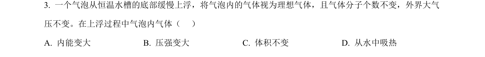
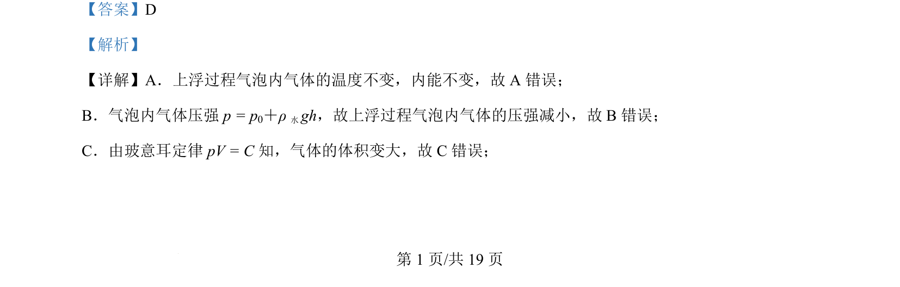
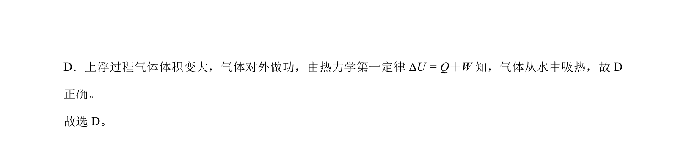

## 题面

## 摘要

气泡上浮过程温度不变，综合考查内能、压强变化、玻意耳定律及热力学第一定律的应用。

## 关联考点

- [[440-热力学第一定律|热力学第一定律]]
- [[444-玻意耳定律|玻意耳定律]]
- [[127-内能|内能]]
- [[096-液体压强|液体压强]]

## 答案与解析

> 📄 原 PDF 第 1 页：`素材/真题/北京/2008-2024·（北京）物理高考真题/2024年高考物理试卷（北京）（解析卷）.pdf`

<!-- 题干文本-start -->
## 题干文本
3. 一个气泡从恒温水槽的底部缓慢上浮，将气泡内的气体视为理想气体，且气体分子个数不变，外界大气
压不变。在上浮过程中气泡内气体（   ）
A. 内能变大 B. 压强变大 C. 体积不变 D. 从水中吸热
<!-- 题干文本-end -->

<!-- 解析文本-start -->
## 解析文本
【答案】D
【解析】
【详解】A．上浮过程气泡内气体的温度不变，内能不变，故 A 错误；
B．气泡内气体压强 p = p0＋ρ 水 gh，故上浮过程气泡内气体的压强减小，故 B错误；
C．由玻意耳定律 pV = C知，气体的体积变大，故 C错误；
的
<!-- 解析文本-end -->
