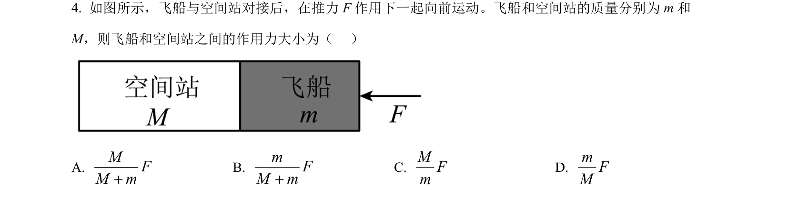
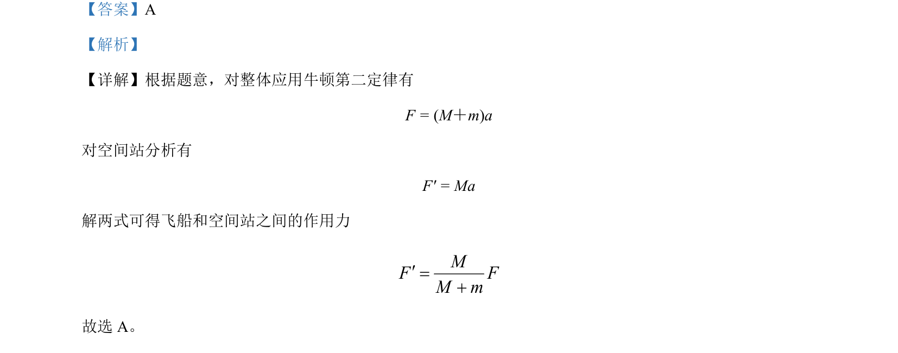

## 题面

## 摘要

该题考查用整体法和隔离法求解连接体中两物体间相互作用力。

## 关联考点

- [[229-牛顿第二定律|牛顿第二定律]]
- [[整体法]]
- [[隔离法]]
- [[240-连接体问题|连接体问题]]

## 答案与解析

> 📄 原 PDF 第 2 页：`素材/真题/北京/2008-2024·（北京）物理高考真题/2024年高考物理试卷（北京）（解析卷）.pdf`
