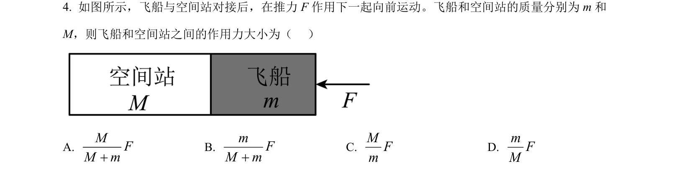

## 题面

## 摘要

该题考查用整体法和隔离法求解连接体中两物体间相互作用力。

## 关联考点

- [[229-牛顿第二定律|牛顿第二定律]]
- [[847-整体法|整体法]]
- [[855-隔离法|隔离法]]
- [[240-连接体问题|连接体问题]]

## 答案与解析

> 📄 原 PDF 第 2 页：`素材/真题/北京/2008-2024·（北京）物理高考真题/2024年高考物理试卷（北京）（解析卷）.pdf`

<!-- 题干文本-start -->
## 题干文本
4. 如图所示，飞船与空间站对接后，在推力 F作用下一起向前运动。飞船和空间站的质量分别为 m 和
M，则飞船和空间站之间的作用力大小为（   ）
A. MFM m+
B. mFM m+
C. MFm
D. mFM
<!-- 题干文本-end -->

<!-- 解析文本-start -->
## 解析文本
【答案】A
【解析】
【详解】根据题意，对整体应用牛顿第二定律有
F = (M＋m)a
对空间站分析有
F′ = Ma
解两式可得飞船和空间站之间的作用力
MF FM m¢=+
故选 A。
<!-- 解析文本-end -->
