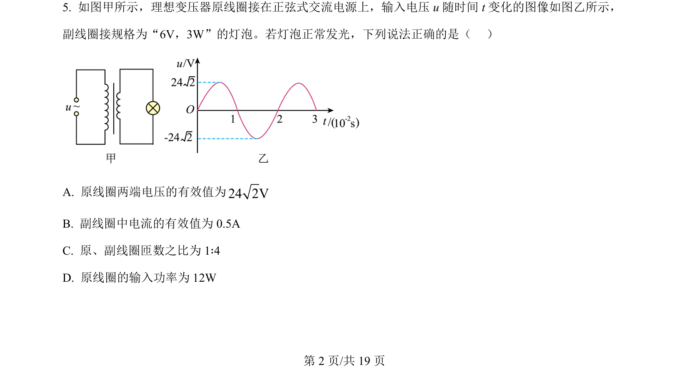
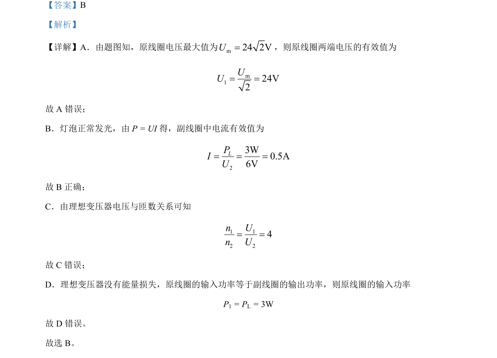

## 题面

## 摘要

交流电路与理想变压器综合，有效值计算、功率与匝数比关系的判断

## 关联考点

- [[398-理想变压器|理想变压器]]
- [[835-交流电有效值|交流电有效值]]
- [[159-电功率|电功率]]
- [[匝数比]]

## 答案与解析

> 📄 原 PDF 第 2 页：`素材/真题/北京/2008-2024·（北京）物理高考真题/2024年高考物理试卷（北京）（解析卷）.pdf`
