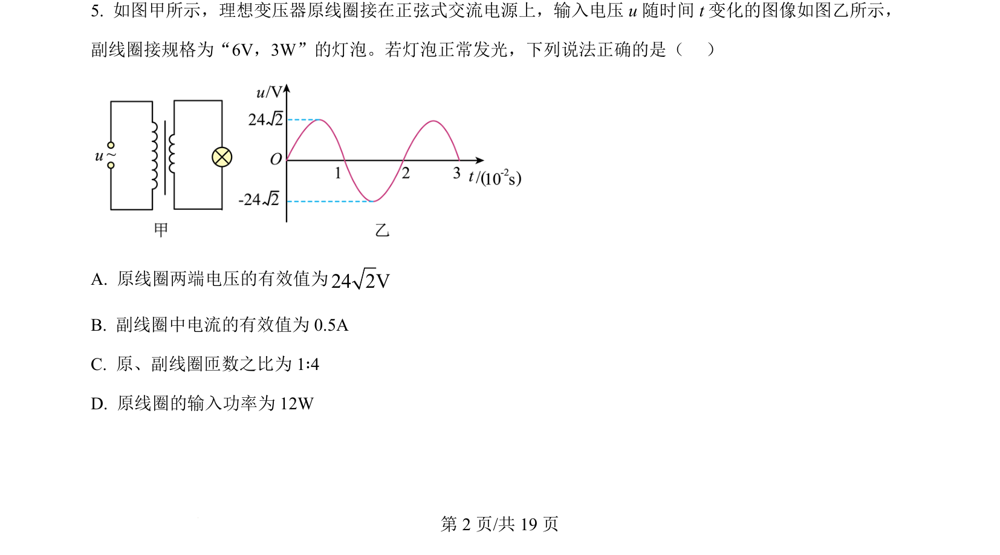
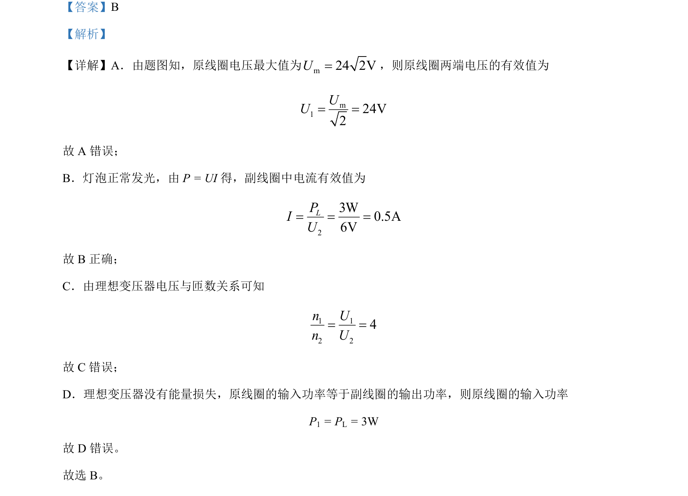

## 题面

## 摘要

交流电路与理想变压器综合，有效值计算、功率与匝数比关系的判断

## 关联考点

- [[398-理想变压器|理想变压器]]
- [[835-交流电有效值|交流电有效值]]
- [[159-电功率|电功率]]
- [[匝数比]]

## 答案与解析

> 📄 原 PDF 第 2 页：`素材/真题/北京/2008-2024·（北京）物理高考真题/2024年高考物理试卷（北京）（解析卷）.pdf`

<!-- 题干文本-start -->
## 题干文本
5. 如图甲所示，理想变压器原线圈接在正弦式交流电源上，输入电压 u 随时间 t变化的图像如图乙所示，
副线圈接规格为“6V，3W”的灯泡。若灯泡正常发光，下列说法正确的是（   ）
A. 原线圈两端电压的有效值为24 2V
B. 副线圈中电流的有效值为 0.5A
C. 原、副线圈匝数之比为 1∶4
D. 原线圈的输入功率为 12W
<!-- 题干文本-end -->

<!-- 解析文本-start -->
## 解析文本

<!-- 解析文本-end -->
