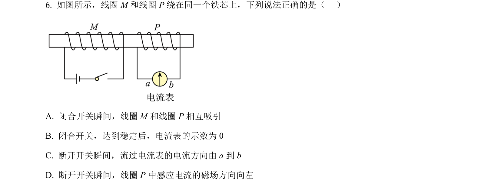
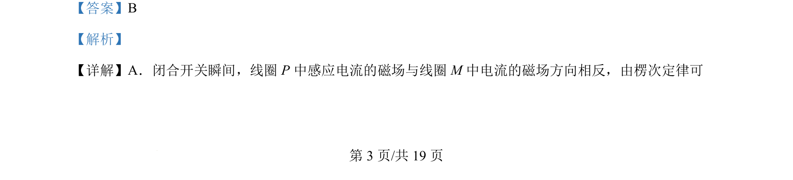
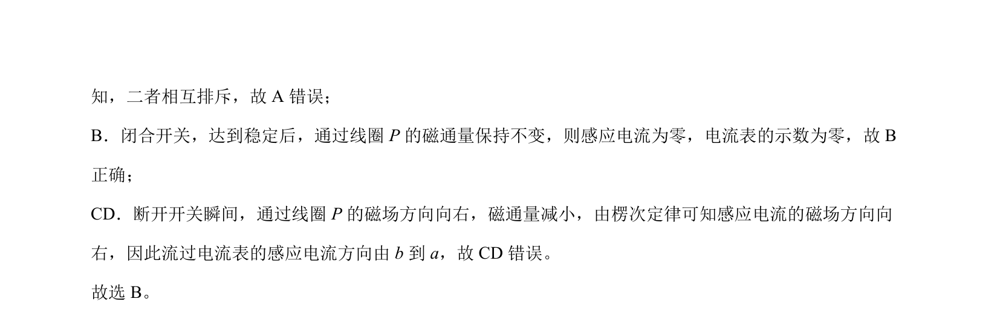

## 题面

## 摘要

闭合开关与断开开关瞬间线圈P中的电磁感应现象，判断感应电流方向及线圈间相互作用力，分析稳定后电流表示数。

## 关联考点

- [[393-楞次定律|楞次定律]]
- [[175-电磁感应|电磁感应]]
- [[377-互感|互感]]
- [[感应电流方向]]

## 答案与解析

> 📄 原 PDF 第 3 页：`素材/真题/北京/2008-2024·（北京）物理高考真题/2024年高考物理试卷（北京）（解析卷）.pdf`
