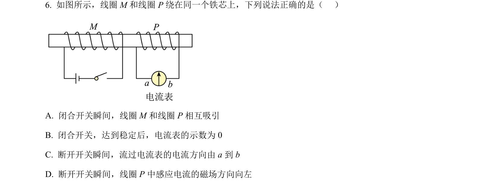
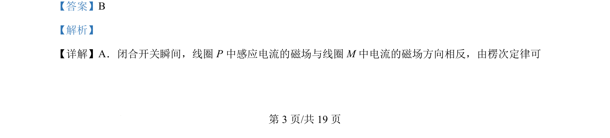
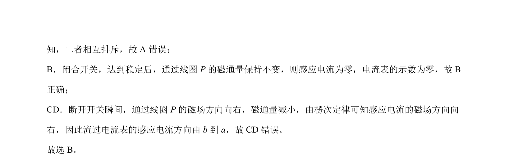

## 题面

## 摘要

闭合开关与断开开关瞬间线圈P中的电磁感应现象，判断感应电流方向及线圈间相互作用力，分析稳定后电流表示数。

## 关联考点

- [[393-楞次定律|楞次定律]]
- [[175-电磁感应|电磁感应]]
- [[377-互感|互感]]
- [[845-感应电流方向|感应电流方向]]

## 答案与解析

> 📄 原 PDF 第 3 页：`素材/真题/北京/2008-2024·（北京）物理高考真题/2024年高考物理试卷（北京）（解析卷）.pdf`

<!-- 题干文本-start -->
## 题干文本
6. 如图所示，线圈 M 和线圈 P绕在同一个铁芯上，下列说法正确的是（   ）
A. 闭合开关瞬间，线圈 M 和线圈 P相互吸引
B. 闭合开关，达到稳定后，电流表的示数为 0
C. 断开开关瞬间，流过电流表的电流方向由 a 到 b
D. 断开开关瞬间，线圈 P中感应电流的磁场方向向左
<!-- 题干文本-end -->

<!-- 解析文本-start -->
## 解析文本
【答案】B
【解析】
【详解】A．闭合开关瞬间，线圈 P中感应电流的磁场与线圈 M 中电流的磁场方向相反，由楞次定律可
<!-- 解析文本-end -->
