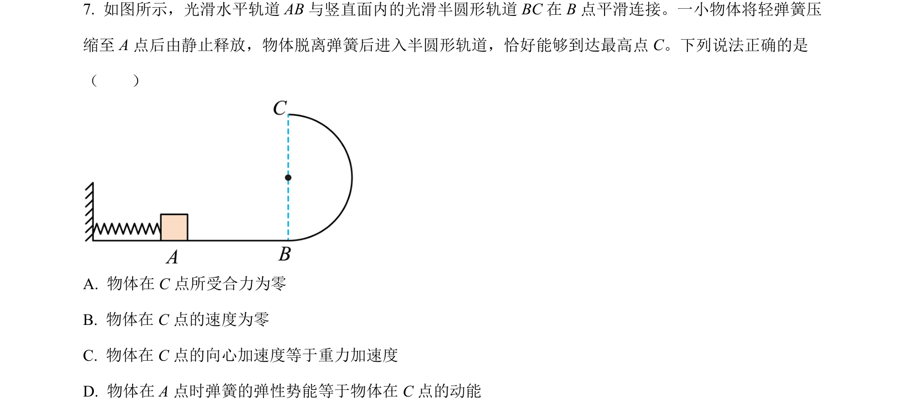
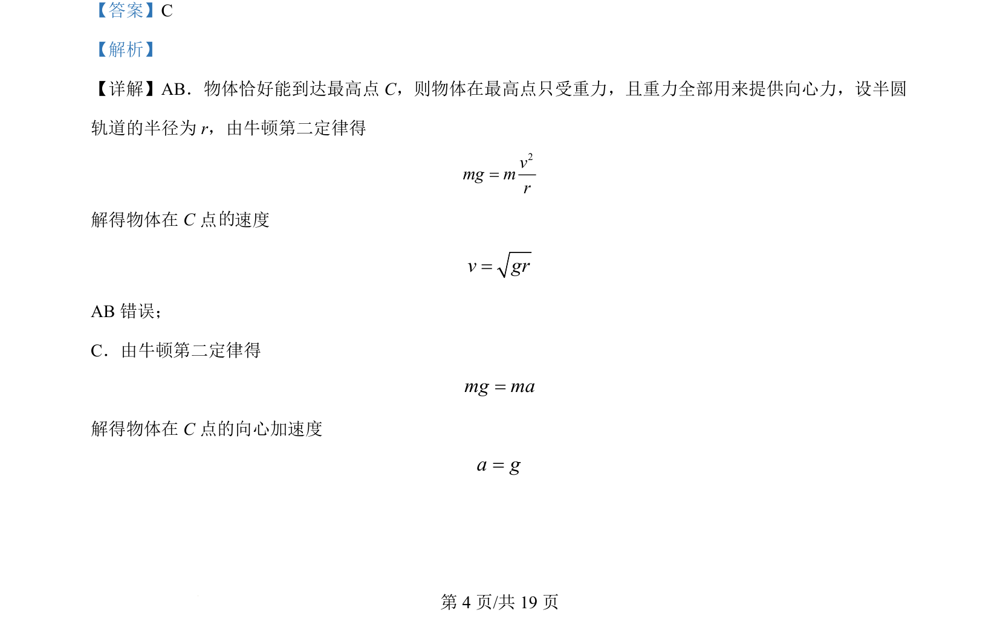
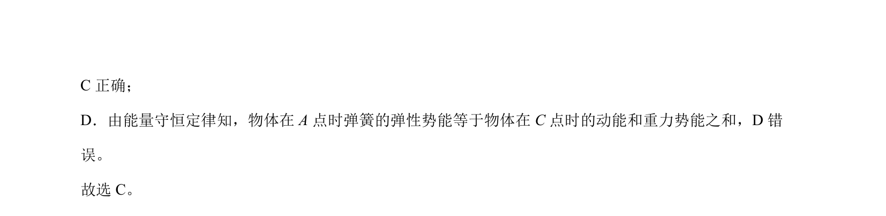

## 题面

## 摘要

物体在半圆轨道最高点受力与运动分析，综合牛顿运动定律和能量守恒定律判断选项正误。

## 关联考点

- [[229-牛顿第二定律|牛顿第二定律]]
- [[561-向心力公式|向心力公式]]
- [[197-能量守恒定律|能量守恒定律]]

## 答案与解析

> 📄 原 PDF 第 4 页：`素材/真题/北京/2008-2024·（北京）物理高考真题/2024年高考物理试卷（北京）（解析卷）.pdf`
