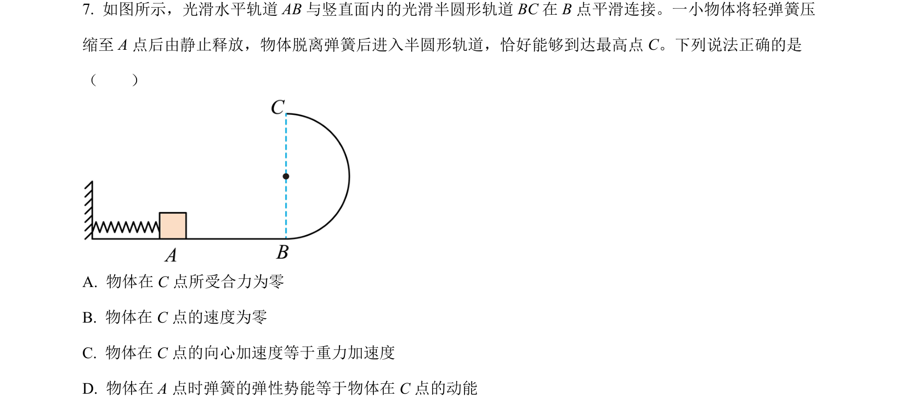
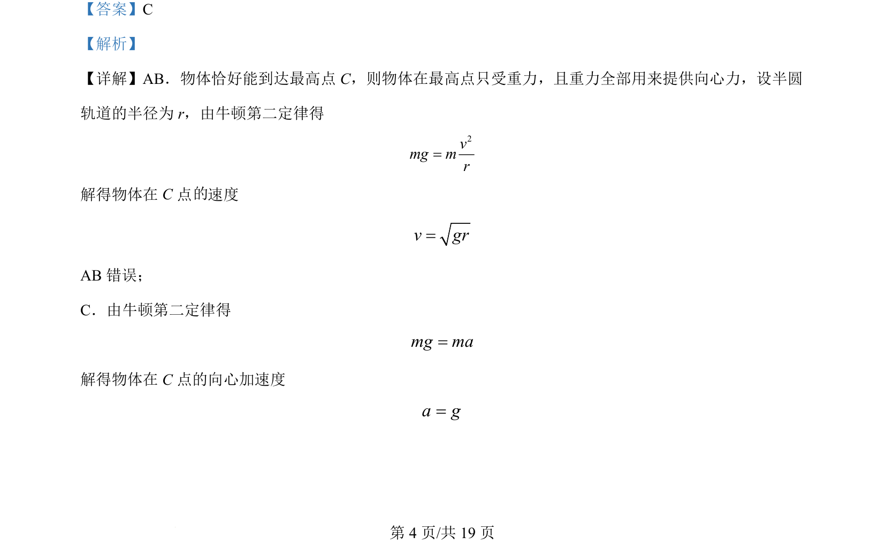
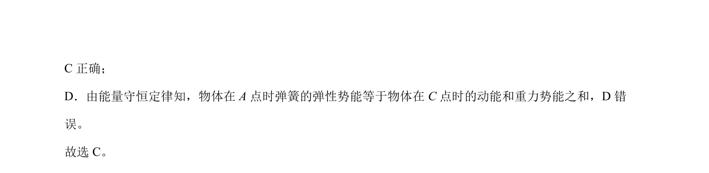

## 题面

## 摘要

物体在半圆轨道最高点受力与运动分析，综合牛顿运动定律和能量守恒定律判断选项正误。

## 关联考点

- [[229-牛顿第二定律|牛顿第二定律]]
- [[561-向心力公式|向心力公式]]
- [[197-能量守恒定律|能量守恒定律]]

## 答案与解析

> 📄 原 PDF 第 4 页：`素材/真题/北京/2008-2024·（北京）物理高考真题/2024年高考物理试卷（北京）（解析卷）.pdf`

<!-- 题干文本-start -->
## 题干文本
7. 如图所示，光滑水平轨道 AB与竖直面内的光滑半圆形轨道 BC在 B点平滑连接。一小物体将轻弹簧压
缩至 A点后由静止释放，物体脱离弹簧后进入半圆形轨道，恰好能够到达最高点 C。下列说法正确的是
（　　）
A. 物体在 C点所受合力为零
B. 物体在 C点的速度为零
C. 物体在 C点的向心加速度等于重力加速度
D. 物体在 A点时弹簧的弹性势能等于物体在 C点的动能
<!-- 题干文本-end -->

<!-- 解析文本-start -->
## 解析文本
【答案】C
【解析】
【详解】AB．物体恰好能到达最高点 C，则物体在最高点只受重力，且重力全部用来提供向心力，设半圆
轨道的半径为 r，由牛顿第二定律得
2vmg mr=
解得物体在 C点 速度
v gr=
AB 错误；
C．由牛顿第二定律得
mg ma=
解得物体在 C点的向心加速度
a g=
的
<!-- 解析文本-end -->
