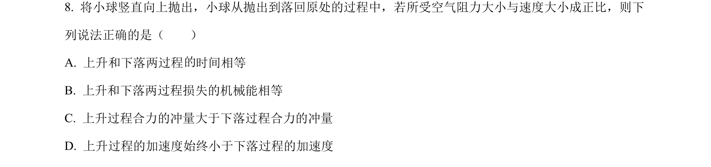
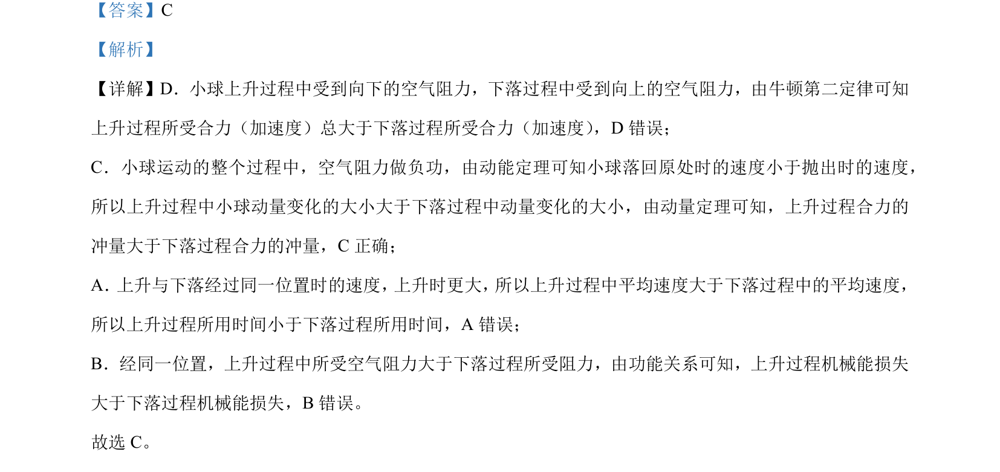

## 题面

## 摘要

小球在空气阻力下的竖直上抛运动，比较上升与下落过程的合力、时间、动量变化及机械能损失。

## 关联考点

- [[229-牛顿第二定律|牛顿第二定律]]
- [[251-动能定理|动能定理]]
- [[349-动量定理|动量定理]]
- [[249-功能关系|功能关系]]

## 答案与解析

> 📄 原 PDF 第 5 页：`素材/真题/北京/2008-2024·（北京）物理高考真题/2024年高考物理试卷（北京）（解析卷）.pdf`
