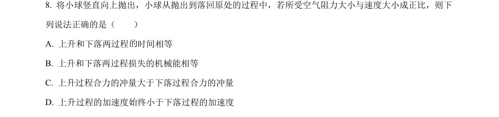
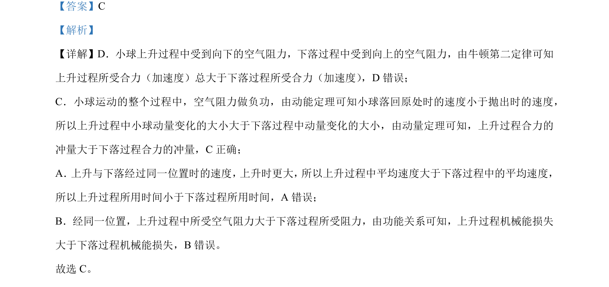

## 题面

## 摘要

小球在空气阻力下的竖直上抛运动，比较上升与下落过程的合力、时间、动量变化及机械能损失。

## 关联考点

- [[229-牛顿第二定律|牛顿第二定律]]
- [[251-动能定理|动能定理]]
- [[349-动量定理|动量定理]]
- [[249-功能关系|功能关系]]

## 答案与解析

> 📄 原 PDF 第 5 页：`素材/真题/北京/2008-2024·（北京）物理高考真题/2024年高考物理试卷（北京）（解析卷）.pdf`

<!-- 题干文本-start -->
## 题干文本
8. 将小球竖直向上抛出，小球从抛出到落回原处的过程中，若所受空气阻力大小与速度大小成正比，则下
列说法正确的是（　　）
A. 上升和下落两过程 时间相等
B. 上升和下落两过程损失的机械能相等
C. 上升过程合力的冲量大于下落过程合力的冲量
D. 上升过程的加速度始终小于下落过程的加速度
<!-- 题干文本-end -->

<!-- 解析文本-start -->
## 解析文本
【答案】C
【解析】
【详解】D．小球上升过程中受到向下的空气阻力，下落过程中受到向上的空气阻力，由牛顿第二定律可知
上升过程所受合力（加速度）总大于下落过程所受合力（加速度） ，D 错误；
C．小球运动的整个过程中，空气阻力做负功，由动能定理可知小球落回原处时的速度小于抛出时的速度，
所以上升过程中小球动量变化的大小大于下落过程中动量变化的大小，由动量定理可知，上升过程合力的
冲量大于下落过程合力的冲量，C正确；
A． 上升与下落经过同一位置时的速度， 上升时更大， 所以上升过程中平均速度大于下落过程中的平均速度，
所以上升过程所用时间小于下落过程所用时间，A 错误；
B．经同一位置，上升过程中所受空气阻力大于下落过程所受阻力，由功能关系可知，上升过程机械能损失
大于下落过程机械能损失，B错误。
故选 C。
<!-- 解析文本-end -->
