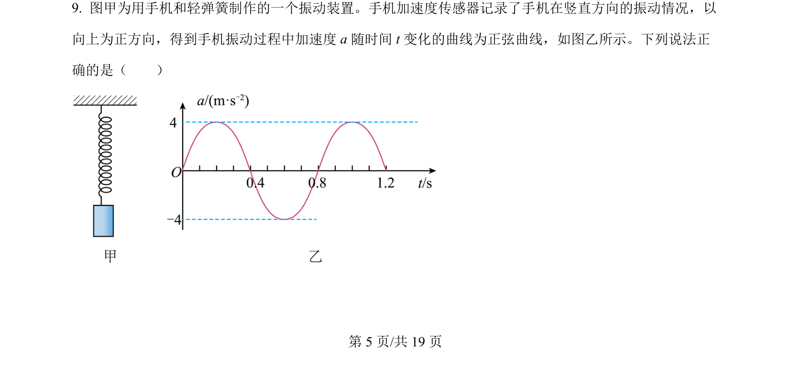
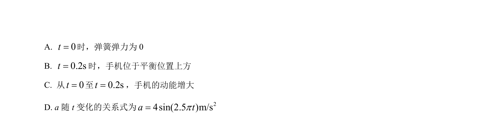
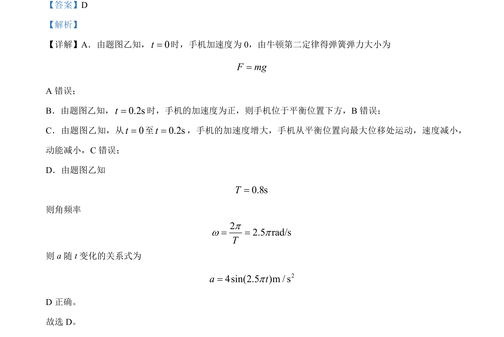

## 题面

## 摘要

手机在弹簧作用下做简谐运动，结合加速度-时间图像分析运动过程和牛顿第二定律应用。

## 关联考点

- [[373-简谐运动|简谐运动]]
- [[振动图像]]
- [[229-牛顿第二定律|牛顿第二定律]]
- [[周期与角频率]]

## 答案与解析

> 📄 原 PDF 第 5 页：`素材/真题/北京/2008-2024·（北京）物理高考真题/2024年高考物理试卷（北京）（解析卷）.pdf`
