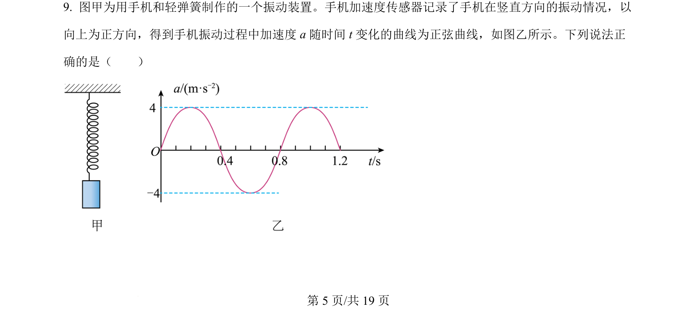
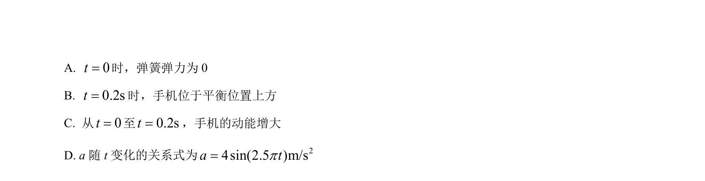
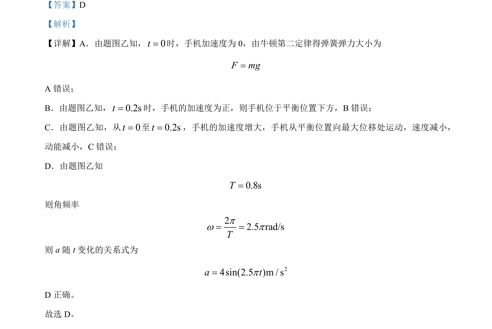

## 题面

## 摘要

手机在弹簧作用下做简谐运动，结合加速度-时间图像分析运动过程和牛顿第二定律应用。

## 关联考点

- [[373-简谐运动|简谐运动]]
- [[857-振动图像|振动图像]]
- [[229-牛顿第二定律|牛顿第二定律]]
- [[周期与角频率]]

## 答案与解析

> 📄 原 PDF 第 5 页：`素材/真题/北京/2008-2024·（北京）物理高考真题/2024年高考物理试卷（北京）（解析卷）.pdf`

<!-- 题干文本-start -->
## 题干文本
9. 图甲为用手机和轻弹簧制作的一个振动装置。手机加速度传感器记录了手机在竖直方向的振动情况，以
向上为正方向，得到手机振动过程中加速度 a 随时间 t变化的曲线为正弦曲线，如图乙所示。下列说法正
确的是（　　）
的
<!-- 题干文本-end -->

<!-- 解析文本-start -->
## 解析文本

<!-- 解析文本-end -->
