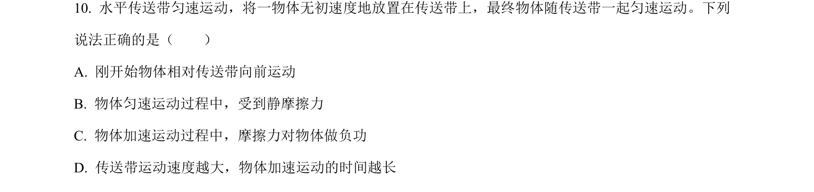
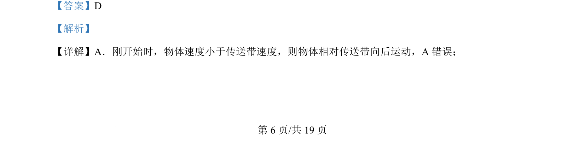
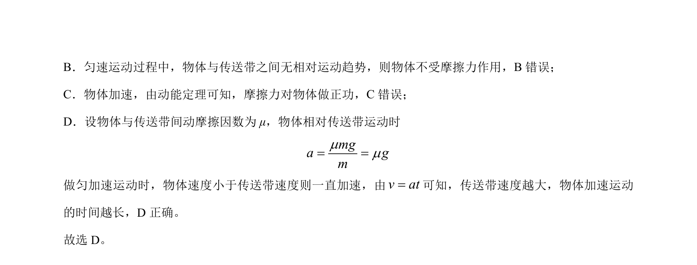

## 题面

## 摘要

物体在水平传送带上加速与匀速过程中的相对运动、摩擦力方向及做功情况分析。

## 关联考点

- [[790-传送带模型|传送带模型]]
- [[081-摩擦力|摩擦力]]
- [[280-相对运动|相对运动]]
- [[541-匀加速运动|匀加速运动]]

## 答案与解析

> 📄 原 PDF 第 6 页：`素材/真题/北京/2008-2024·（北京）物理高考真题/2024年高考物理试卷（北京）（解析卷）.pdf`
