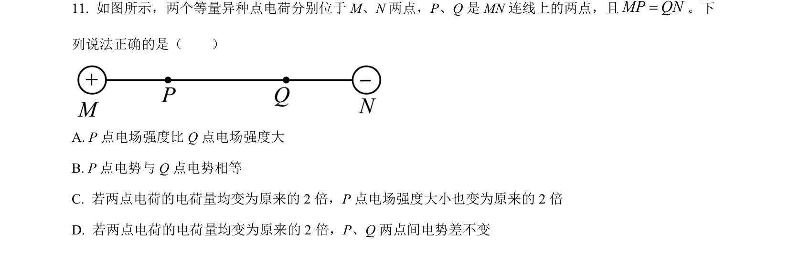
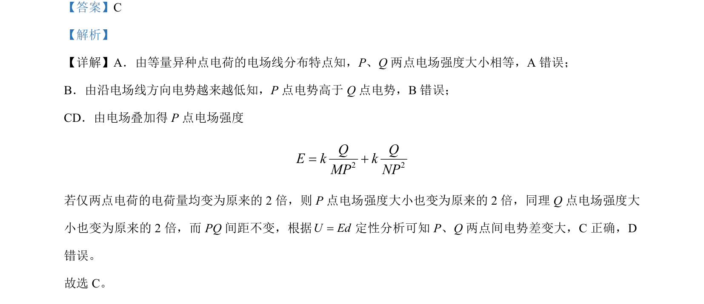

## 题面

## 摘要

等量异种点电荷的电场分布及电场强度、电势、电势差的变化规律。

## 关联考点

- [[277-电场强度|电场强度]]
- [[308-电势|电势]]
- [[163-电压|电势差]]
- [[等量异种点电荷]]

## 答案与解析

> 📄 原 PDF 第 7 页：`素材/真题/北京/2008-2024·（北京）物理高考真题/2024年高考物理试卷（北京）（解析卷）.pdf`
