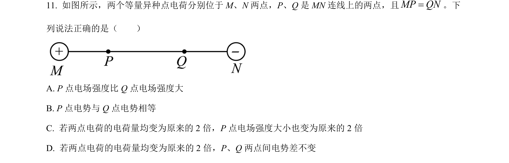
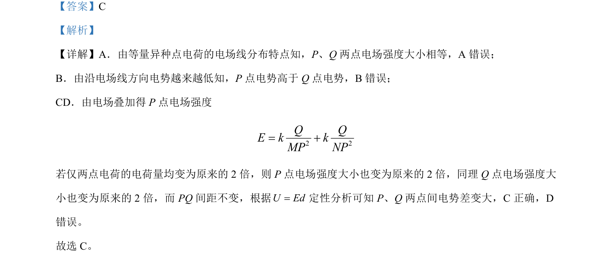

## 题面

## 摘要

等量异种点电荷的电场分布及电场强度、电势、电势差的变化规律。

## 关联考点

- [[277-电场强度|电场强度]]
- [[308-电势|电势]]
- [[163-电压|电势差]]
- [[等量异种点电荷]]

## 答案与解析

> 📄 原 PDF 第 7 页：`素材/真题/北京/2008-2024·（北京）物理高考真题/2024年高考物理试卷（北京）（解析卷）.pdf`

<!-- 题干文本-start -->
## 题干文本
11. 如图所示，两个等量异种点电荷分别位于 M、N两点，P、Q 是 MN 连线上的两点，且MP QN=。下
列说法正确的是（　　）
A. P 点电场强度比 Q 点电场强度大
B. P点电势与 Q 点电势相等
C. 若两点电荷的电荷量均变为原来的 2 倍，P点电场强度大小也变为原来的 2 倍
D. 若两点电荷的电荷量均变为原来的 2 倍，P、Q 两点间电势差不变
<!-- 题干文本-end -->

<!-- 解析文本-start -->
## 解析文本
【答案】C
【解析】
【详解】A．由等量异种点电荷的电场线分布特点知，P、Q 两点电场强度大小相等，A 错误；
B．由沿电场线方向电势越来越低知，P点电势高于 Q 点电势，B错误；
CD．由电场叠加得 P点电场强度
2 2Q QE k kMP NP= +
若仅两点电荷的电荷量均变为原来的 2 倍，则 P 点电场强度大小也变为原来的 2 倍，同理 Q 点电场强度大
小也变为原来的 2 倍，而 PQ 间距不变，根据U Ed=定性分析可知 P、Q 两点间电势差变大，C 正确，D
错误。
故选 C。
<!-- 解析文本-end -->
