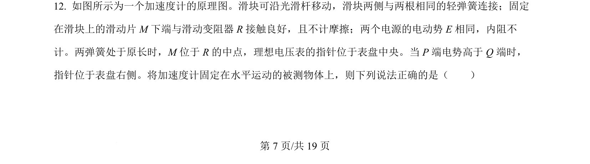
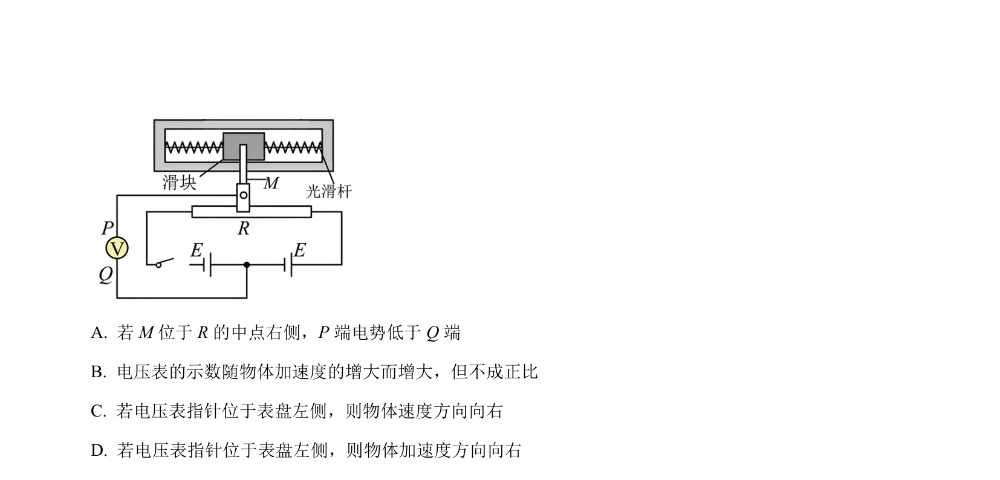
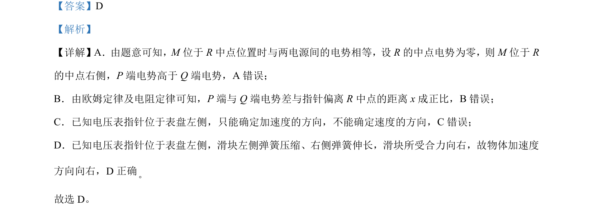

## 题面

## 摘要

该题考查利用电势差与电阻关系分析滑块加速度方向，涉及电路与力学综合判断。

## 关联考点

- [[308-电势|电势]]
- [[141-欧姆定律-初中|欧姆定律]]
- [[318-电阻定律|电阻定律]]
- [[229-牛顿第二定律|牛顿第二定律]]

## 答案与解析

> 📄 原 PDF 第 7 页：`素材/真题/北京/2008-2024·（北京）物理高考真题/2024年高考物理试卷（北京）（解析卷）.pdf`
