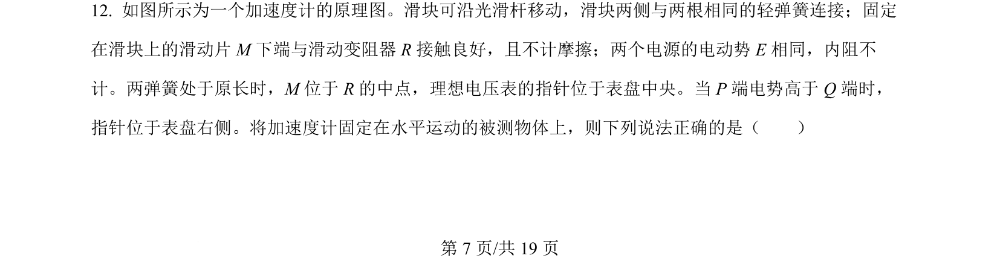
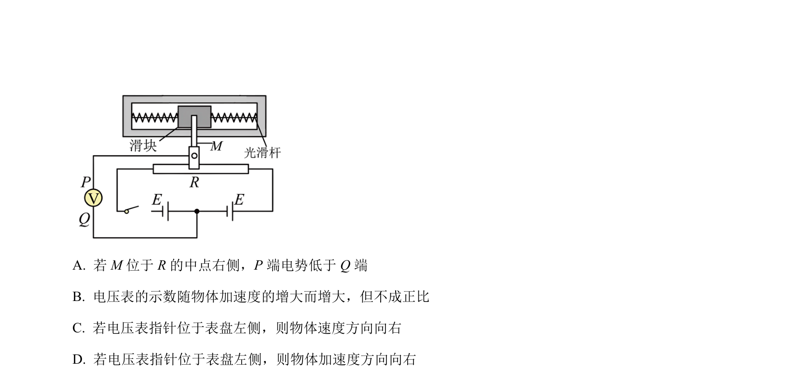
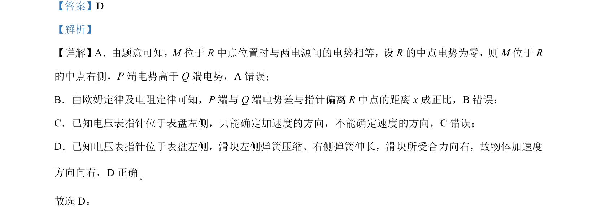

## 题面

## 摘要

该题考查利用电势差与电阻关系分析滑块加速度方向，涉及电路与力学综合判断。

## 关联考点

- [[308-电势|电势]]
- [[141-欧姆定律-初中|欧姆定律]]
- [[318-电阻定律|电阻定律]]
- [[229-牛顿第二定律|牛顿第二定律]]

## 答案与解析

> 📄 原 PDF 第 7 页：`素材/真题/北京/2008-2024·（北京）物理高考真题/2024年高考物理试卷（北京）（解析卷）.pdf`

<!-- 题干文本-start -->
## 题干文本
12. 如图所示为一个加速度计的原理图。滑块可沿光滑杆移动，滑块两侧与两根相同的轻弹簧连接；固定
在滑块上的滑动片 M 下端与滑动变阻器 R接触良好，且不计摩擦；两个电源的电动势 E相同，内阻不
计。两弹簧处于原长时，M 位于 R的中点，理想电压表的指针位于表盘中央。当 P端电势高于 Q 端时，
指针位于表盘右侧。将加速度计固定在水平运动的被测物体上，则下列说法正确的是（　　）
<!-- 题干文本-end -->

<!-- 解析文本-start -->
## 解析文本

<!-- 解析文本-end -->
