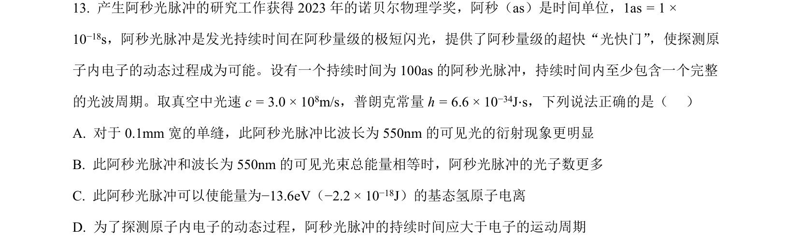
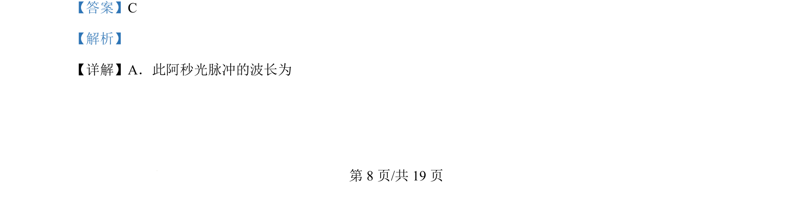
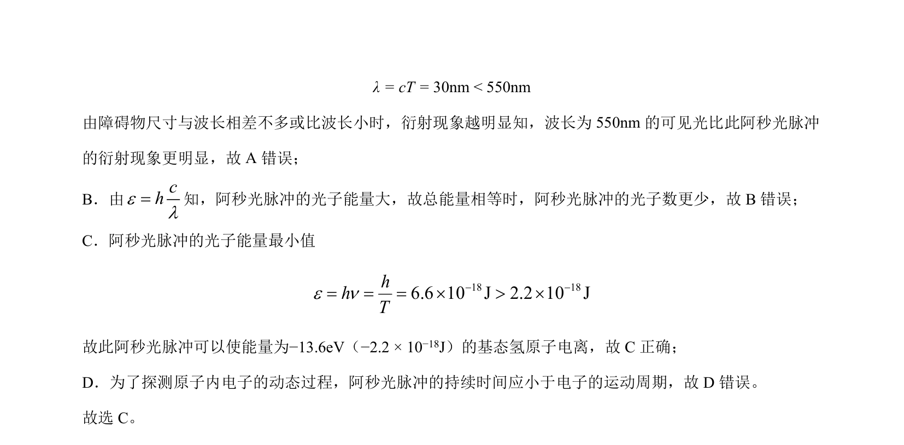

## 题面

## 摘要

阿秒光脉冲的波长、衍射、光子能量及使氢原子电离的条件判断

## 关联考点

- [[342-光的衍射-高中|光的衍射]]
- [[453-光子能量|光子能量]]
- [[氢原子电离]]
- [[阿秒光脉冲]]

## 答案与解析

> 📄 原 PDF 第 8 页：`素材/真题/北京/2008-2024·（北京）物理高考真题/2024年高考物理试卷（北京）（解析卷）.pdf`
