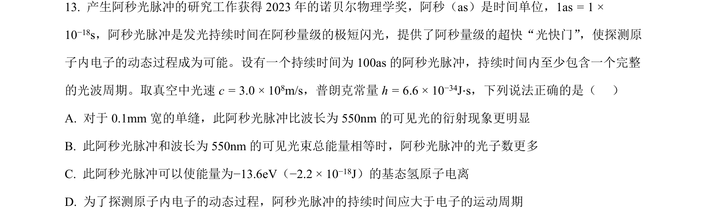
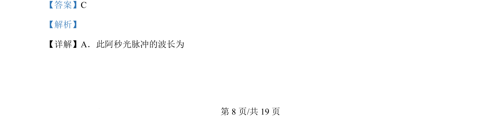
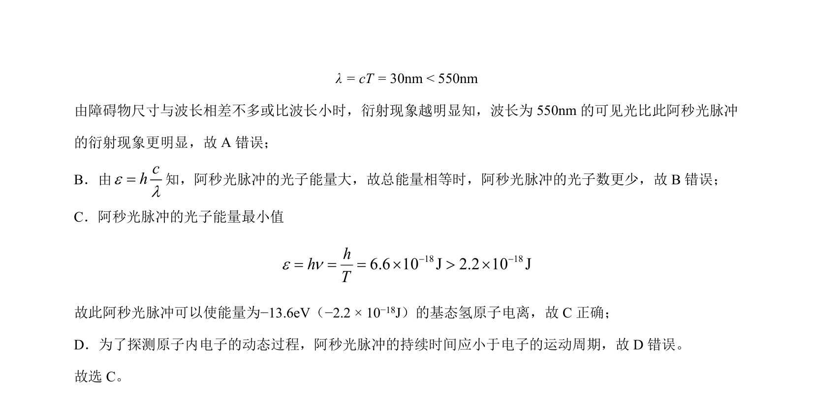

## 题面

## 摘要

阿秒光脉冲的波长、衍射、光子能量及使氢原子电离的条件判断

## 关联考点

- [[342-光的衍射-高中|光的衍射]]
- [[453-光子能量|光子能量]]
- [[氢原子电离]]
- [[阿秒光脉冲]]

## 答案与解析

> 📄 原 PDF 第 8 页：`素材/真题/北京/2008-2024·（北京）物理高考真题/2024年高考物理试卷（北京）（解析卷）.pdf`

<!-- 题干文本-start -->
## 题干文本
13. 产生阿秒光脉冲的研究工作获得 2023 年的诺贝尔物理学奖，阿秒（as）是时间单位，1as = 1 × 
10−18s，阿秒光脉冲是发光持续时间在阿秒量级的极短闪光，提供了阿秒量级的超快“光快门”，使探测原
子内电子的动态过程成为可能。设有一个持续时间为 100as 的阿秒光脉冲，持续时间内至少包含一个完整
的光波周期。取真空中光速 c = 3.0 × 108m/s，普朗克常量 h = 6.6 × 10−34J⋅s，下列说法正确的是（   ）
A. 对于 0.1mm宽的单缝，此阿秒光脉冲比波长为 550nm的可见光的衍射现象更明显
B. 此阿秒光脉冲和波长为 550nm的可见光束总能量相等时，阿秒光脉冲的光子数更多
C. 此阿秒光脉冲可以使能量为−13.6eV（−2.2 × 10−18J）的基态氢原子电离
D. 为了探测原子内电子的动态过程，阿秒光脉冲的持续时间应大于电子的运动周期
<!-- 题干文本-end -->

<!-- 解析文本-start -->
## 解析文本
【答案】C
【解析】
【详解】A．此阿秒光脉冲的波长为
。
<!-- 解析文本-end -->
