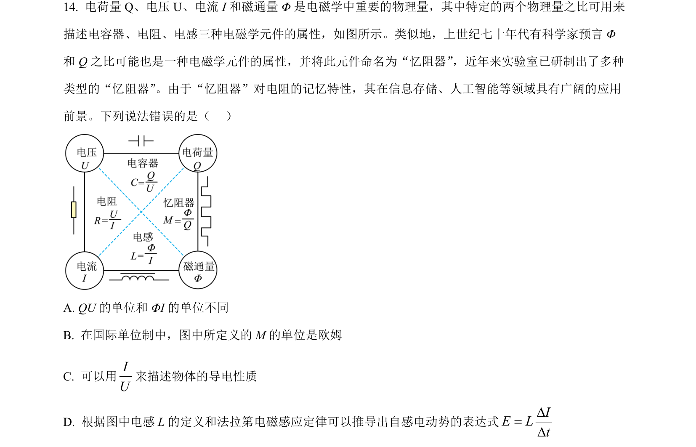
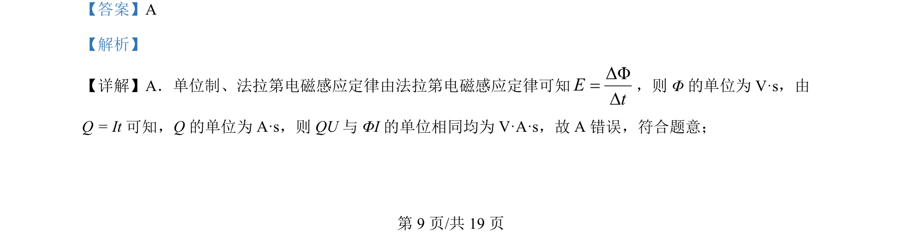
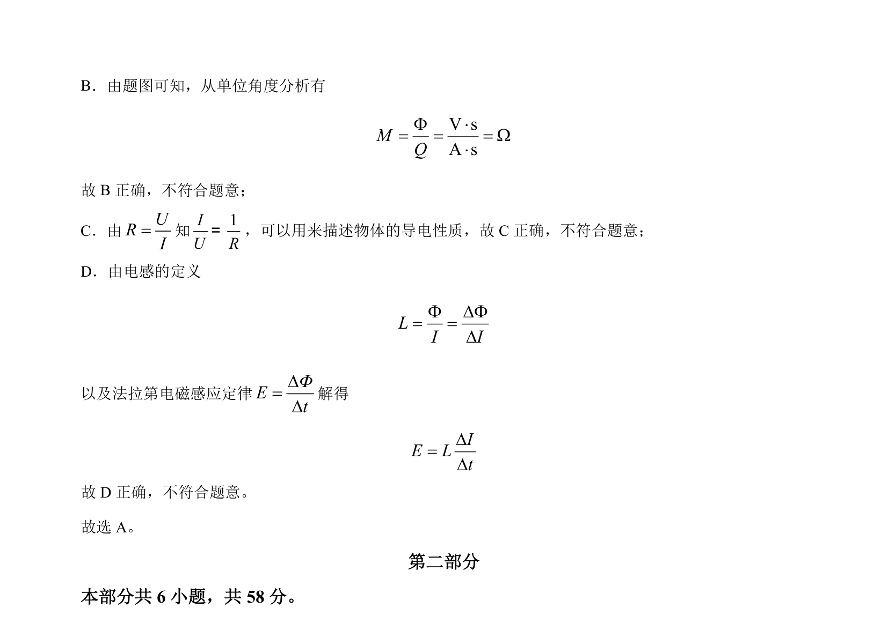

## 题面

## 摘要

本题通过法拉第电磁感应定律、电路基本关系及电感定义，考查物理量的单位推导与电学量纲分析。

## 关联考点

- [[395-法拉第电磁感应定律|法拉第电磁感应定律]]
- [[830-单位制|单位制]]
- [[832-量纲分析|量纲分析]]
- [[电感]]

## 答案与解析

> 📄 原 PDF 第 9 页：`素材/真题/北京/2008-2024·（北京）物理高考真题/2024年高考物理试卷（北京）（解析卷）.pdf`
