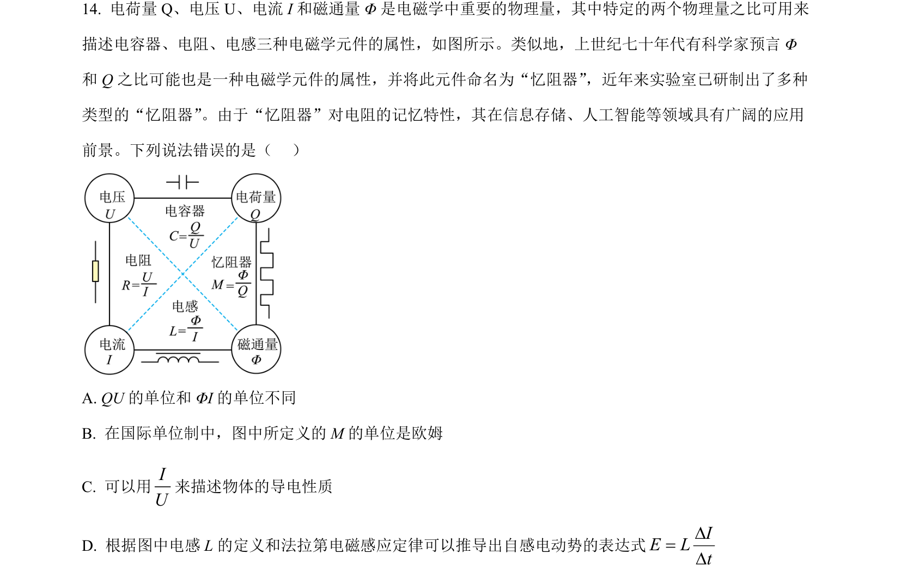
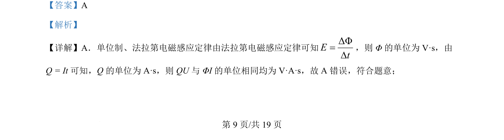
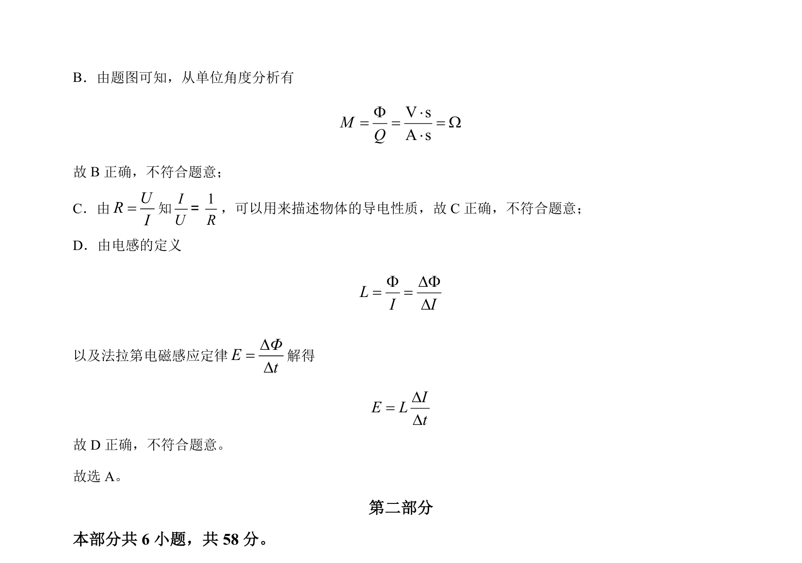

## 题面

## 摘要

本题通过法拉第电磁感应定律、电路基本关系及电感定义，考查物理量的单位推导与电学量纲分析。

## 关联考点

- [[395-法拉第电磁感应定律|法拉第电磁感应定律]]
- [[830-单位制|单位制]]
- [[832-量纲分析|量纲分析]]
- [[电感]]

## 答案与解析

> 📄 原 PDF 第 9 页：`素材/真题/北京/2008-2024·（北京）物理高考真题/2024年高考物理试卷（北京）（解析卷）.pdf`

<!-- 题干文本-start -->
## 题干文本
14. 电荷量 Q、电压 U、电流 I 和磁通量 Φ 是电磁学中重要的物理量，其中特定的两个物理量之比可用来
描述电容器、电阻、电感三种电磁学元件的属性，如图所示。类似地，上世纪七十年代有科学家预言 Φ
和 Q 之比可能也是一种电磁学元件的属性，并将此元件命名为“忆阻器”，近年来实验室已研制出了多种
类型的“忆阻器”。由于“忆阻器”对电阻的记忆特性，其在信息存储、人工智能等领域具有广阔的应用
前景。下列说法错误的是（   ）
A. QU 的单位和 ΦI 的单位不同
B. 在国际单位制中，图中所定义的 M 的单位是欧姆
C. 可以用IU
来描述物体的导电性质
D. 根据图中电感 L 的定义和法拉第电磁感应定律可以推导出自感电动势的表达式IE LtD=D
<!-- 题干文本-end -->

<!-- 解析文本-start -->
## 解析文本
【答案】A
【解析】
【详解】A．单位制、法拉第电磁感应定律由法拉第电磁感应定律可知ΔΦEt=D
，则 Φ 的单位为 V·s，由
Q = It可知，Q 的单位为 A·s，则 QU 与 ΦI 的单位相同均为 V·A·s，故 A 错误，符合题意；
<!-- 解析文本-end -->
