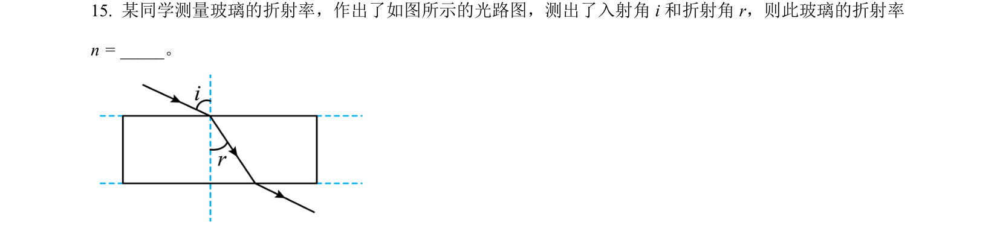
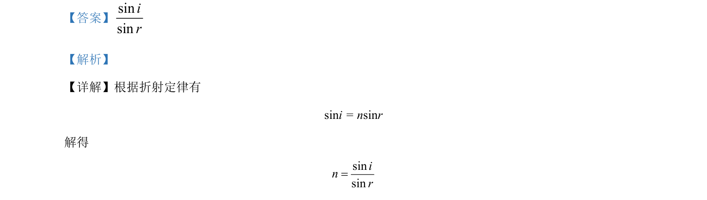

## 题面

## 摘要

该题考查折射定律的基本应用，要求根据入射角和折射角求折射率。

## 关联考点

- [[026-折射定律|折射定律]]
- [[360-折射率|折射率]]

## 答案与解析

> 📄 原 PDF 第 10 页：`素材/真题/北京/2008-2024·（北京）物理高考真题/2024年高考物理试卷（北京）（解析卷）.pdf`

<!-- 题干文本-start -->
## 题干文本
15. 某同学测量玻璃的折射率，作出了如图所示的光路图，测出了入射角 i和折射角 r，则此玻璃的折射率
n = _____。
<!-- 题干文本-end -->

<!-- 解析文本-start -->
## 解析文本
【答案】sinsinir
【解析】
【详解】根据折射定律有
sini = nsinr
解得
sinsininr=
<!-- 解析文本-end -->
