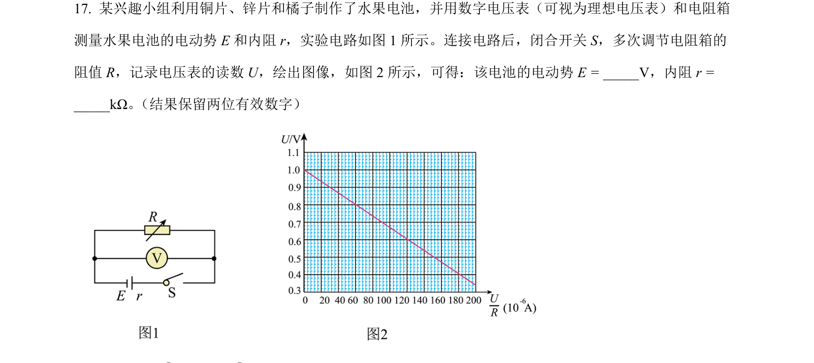
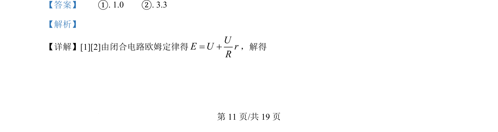

## 题面

## 摘要

利用闭合电路欧姆定律和U-I图像求解电源电动势和内阻。

## 关联考点

- [[332-闭合电路欧姆定律|闭合电路欧姆定律]]
- [[582-实验数据处理|实验数据处理]]
- [[图像法求E和r]]

## 答案与解析

> 📄 原 PDF 第 11 页：`素材/真题/北京/2008-2024·（北京）物理高考真题/2024年高考物理试卷（北京）（解析卷）.pdf`
