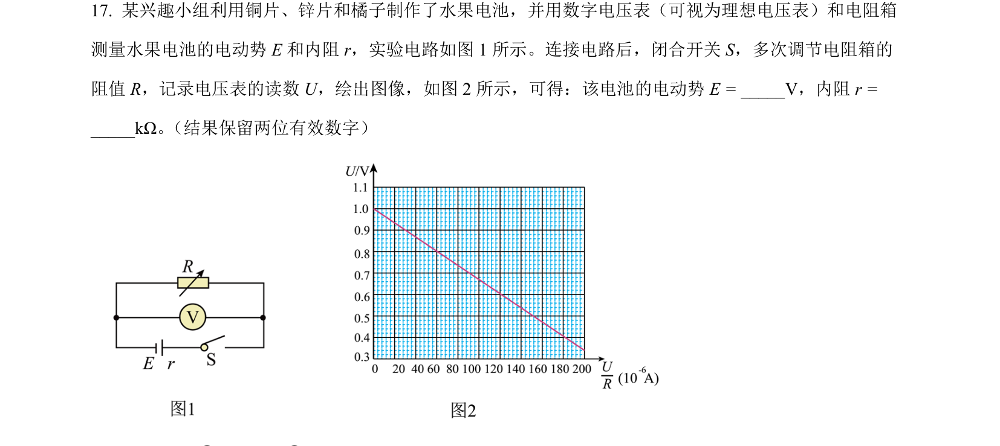

## 题面

## 摘要

利用闭合电路欧姆定律和U-I图像求解电源电动势和内阻。

## 关联考点

- [[332-闭合电路欧姆定律|闭合电路欧姆定律]]
- [[582-实验数据处理|实验数据处理]]
- [[图像法求E和r]]

## 答案与解析

> 📄 原 PDF 第 11 页：`素材/真题/北京/2008-2024·（北京）物理高考真题/2024年高考物理试卷（北京）（解析卷）.pdf`

<!-- 题干文本-start -->
## 题干文本
17. 某兴趣小组利用铜片、锌片和橘子制作了水果电池，并用数字电压表（可视为理想电压表）和电阻箱
测量水果电池的电动势 E和内阻 r，实验电路如图 1 所示。连接电路后，闭合开关 S，多次调节电阻箱的
阻值 R，记录电压表的读数 U，绘出图像，如图 2 所示，可得：该电池的电动势 E = _____V，内阻 r = 
_____kΩ。 （结果保留两位有效数字）
<!-- 题干文本-end -->

<!-- 解析文本-start -->
## 解析文本
【答案】    ①. 1.0    ②. 3.3
【解析】
【详解】[1][2]由闭合电路欧姆定律得UE U rR= +，解得
<!-- 解析文本-end -->
