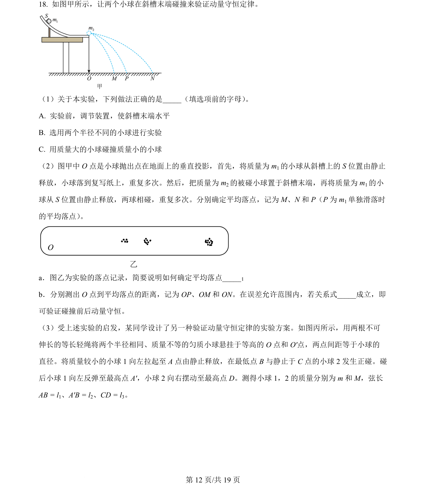
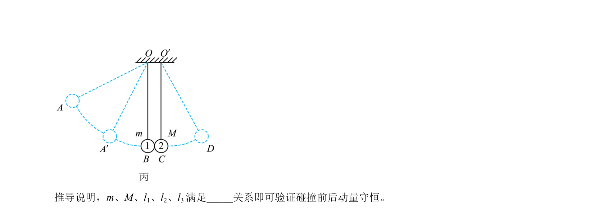
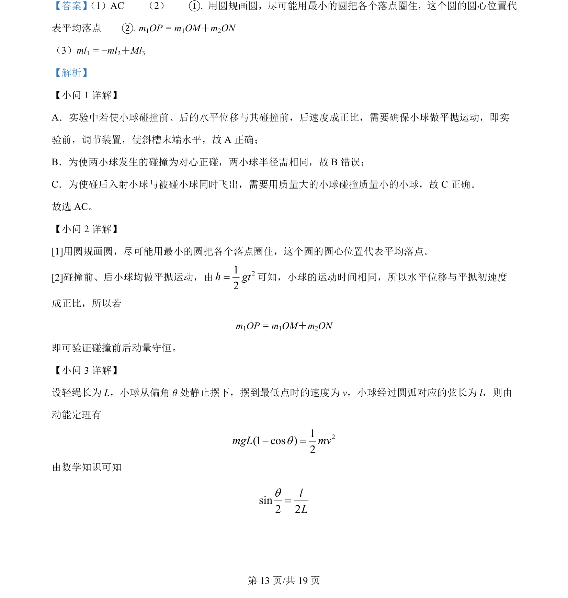
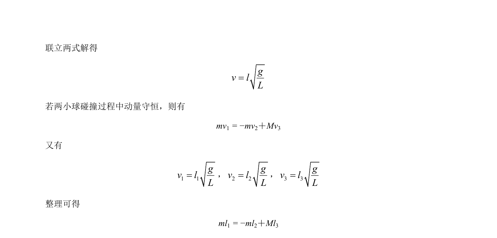

## 题面

## 摘要

验证动量守恒定律实验，通过平抛运动水平位移替代速度，利用弦长关系推导动量守恒表达式。

## 关联考点

- [[验证动量守恒定律]]
- [[261-平抛运动|平抛运动]]
- [[582-实验数据处理|实验数据处理]]
- [[251-动能定理|动能定理]]

## 答案与解析

> 📄 原 PDF 第 12 页：`素材/真题/北京/2008-2024·（北京）物理高考真题/2024年高考物理试卷（北京）（解析卷）.pdf`
