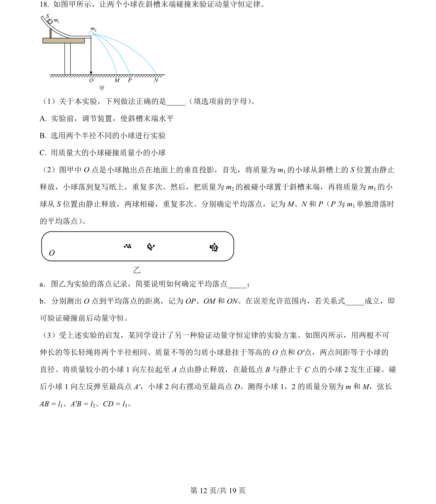
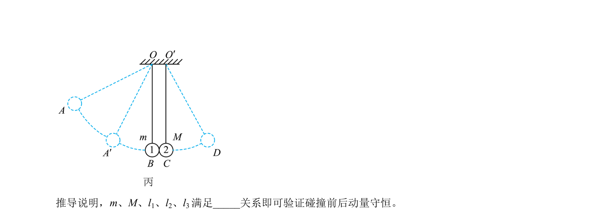
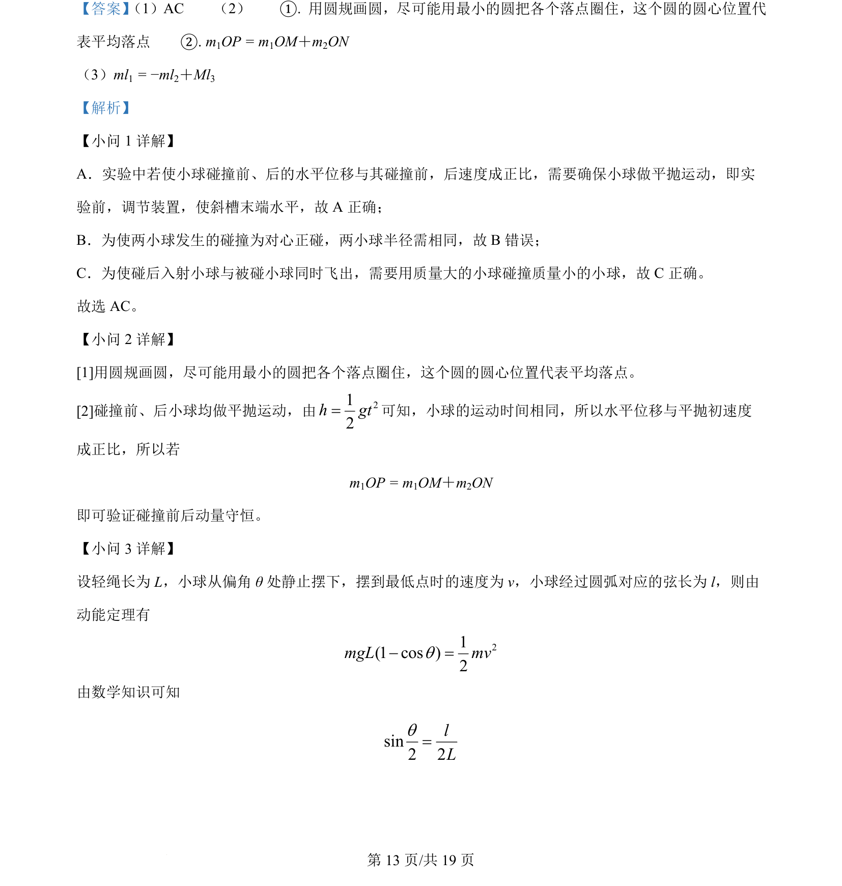
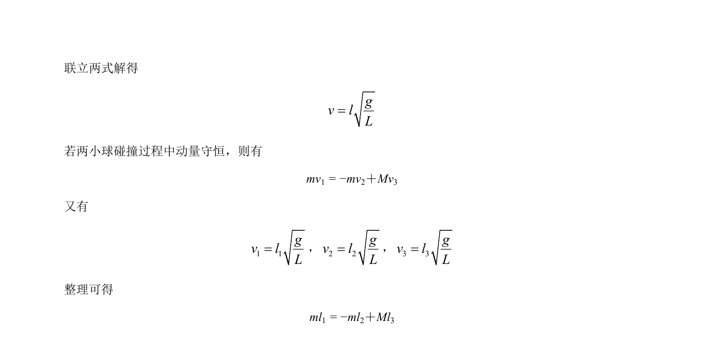

## 题面

## 摘要

验证动量守恒定律实验，通过平抛运动水平位移替代速度，利用弦长关系推导动量守恒表达式。

## 关联考点

- [[验证动量守恒定律]]
- [[261-平抛运动|平抛运动]]
- [[582-实验数据处理|实验数据处理]]
- [[251-动能定理|动能定理]]

## 答案与解析

> 📄 原 PDF 第 12 页：`素材/真题/北京/2008-2024·（北京）物理高考真题/2024年高考物理试卷（北京）（解析卷）.pdf`

<!-- 题干文本-start -->
## 题干文本
18. 如图甲所示，让两个小球在斜槽末端碰撞来验证动量守恒定律。
（1）关于本实验，下列做法正确的是_____（填选项前的字母） 。
A. 实验前，调节装置，使斜槽末端水平
B. 选用两个半径不同的小球进行实验
C. 用质量大的小球碰撞质量小的小球
（2）图甲中 O 点是小球抛出点在地面上的垂直投影，首先，将质量为 m1的小球从斜槽上的 S 位置由静止
释放，小球落到复写纸上，重复多次。然后，把质量为 m2的被碰小球置于斜槽末端，再将质量为 m1的小
球从 S 位置由静止释放，两球相碰，重复多次。分别确定平均落点，记为 M、N和 P（P为 m1单独滑落时
的平均落点） 。
a．图乙为实验的落点记录，简要说明如何确定平均落点_____；
b．分别测出 O 点到平均落点的距离，记为 OP、OM 和 ON。在误差允许范围内，若关系式_____成立，即
可验证碰撞前后动量守恒。
（3）受上述实验的启发，某同学设计了另一种验证动量守恒定律的实验方案。如图丙所示，用两根不可
伸长的等长轻绳将两个半径相同、质量不等的匀质小球悬挂于等高的 O 点和 O′点，两点间距等于小球的
直径。将质量较小的小球 1 向左拉起至 A点由静止释放，在最低点 B与静止于 C点的小球 2 发生正碰。碰
后小球 1 向左反弹至最高点 A′，小球 2 向右摆动至最高点 D。测得小球 1，2 的质量分别为 m 和 M，弦长
AB = l1、A′B = l2、CD = l3。
<!-- 题干文本-end -->

<!-- 解析文本-start -->
## 解析文本

<!-- 解析文本-end -->
