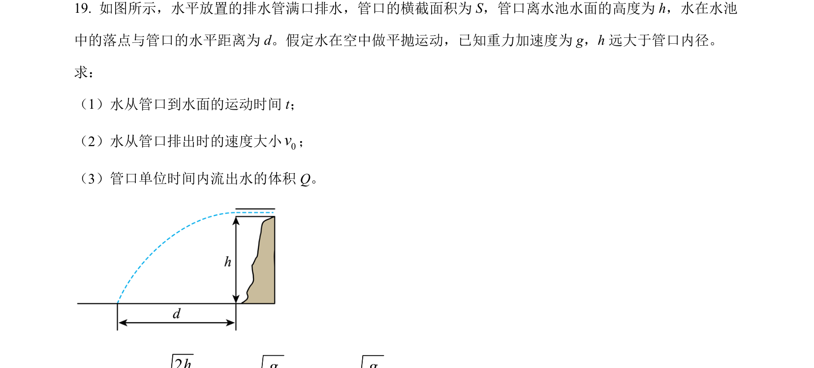
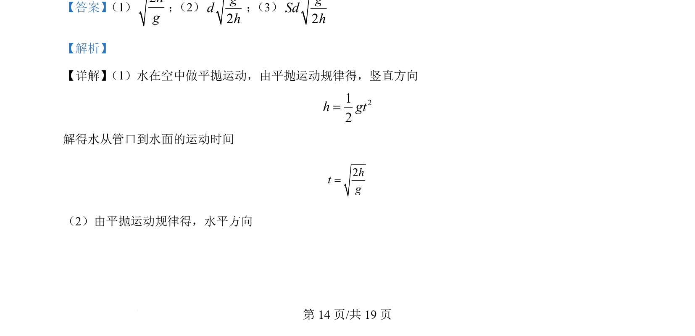
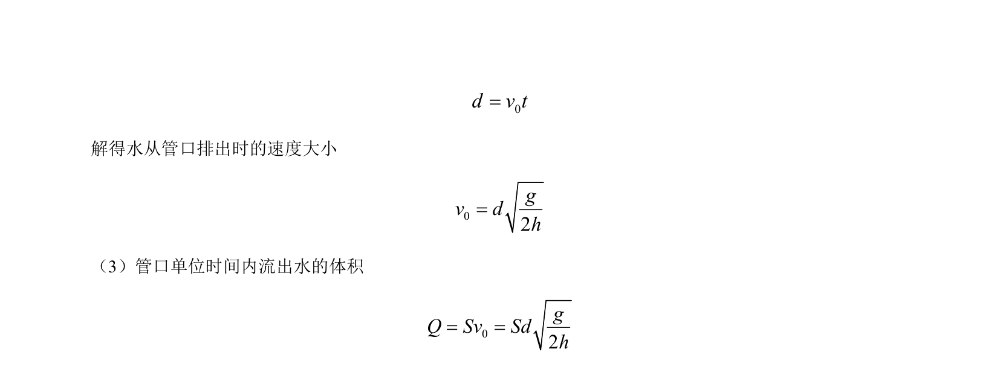

## 题面

## 摘要

考查平抛运动，结合高度和水平位移求时间、初速度及流量。

## 关联考点

- [[261-平抛运动|平抛运动]]
- [[854-自由落体|自由落体]]
- [[流量公式]]

## 答案与解析

> 📄 原 PDF 第 14 页：`素材/真题/北京/2008-2024·（北京）物理高考真题/2024年高考物理试卷（北京）（解析卷）.pdf`

<!-- 题干文本-start -->
## 题干文本
19. 如图所示，水平放置的排水管满口排水，管口的横截面积为 S，管口离水池水面的高度为 h，水在水池
中的落点与管口的水平距离为 d。假定水在空中做平抛运动，已知重力加速度为 g，h 远大于管口内径。
求：
（1）水从管口到水面的运动时间 t；
（2）水从管口排出时的速度大小0v；
（3）管口单位时间内流出水的体积 Q。
<!-- 题干文本-end -->

<!-- 解析文本-start -->
## 解析文本
【答案】 （1）2hg
； （2）
2gdh
； （3）
2gSdh
【解析】
【详解】 （1）水在空中做平抛运动，由平抛运动规律得，竖直方向
212h gt=
解得水从管口到水面的运动时间
2htg=
（2）由平抛运动规律得，水平方向
<!-- 解析文本-end -->
