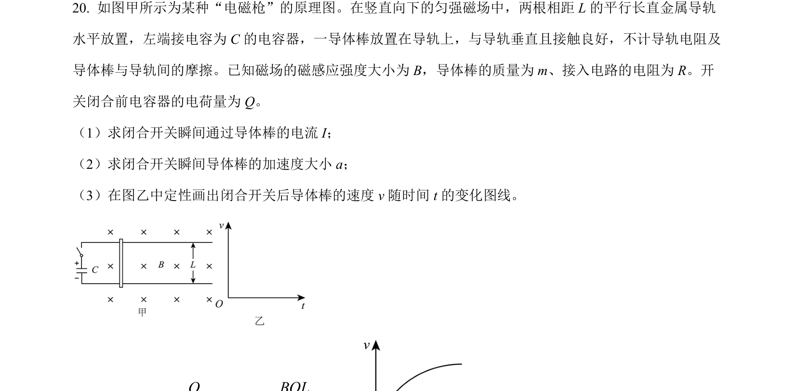
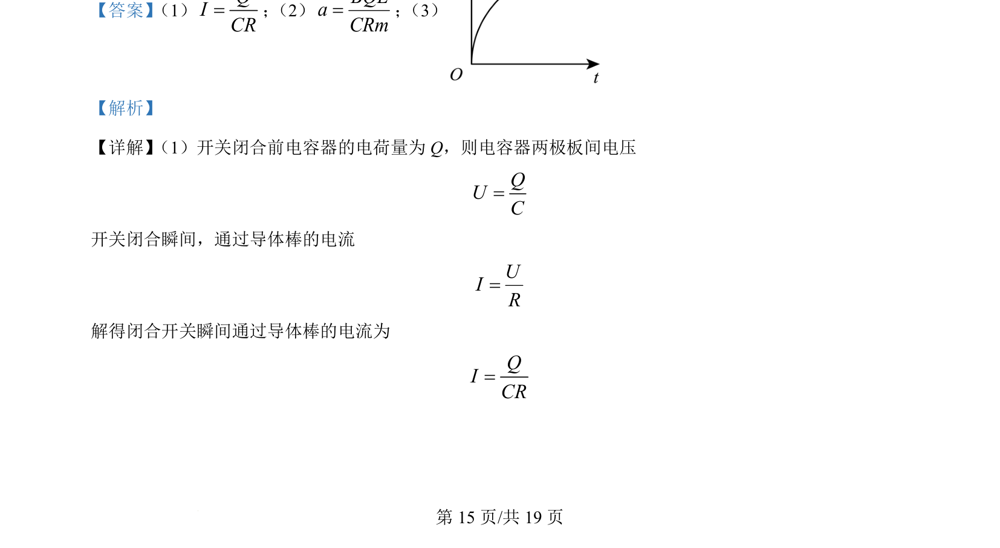
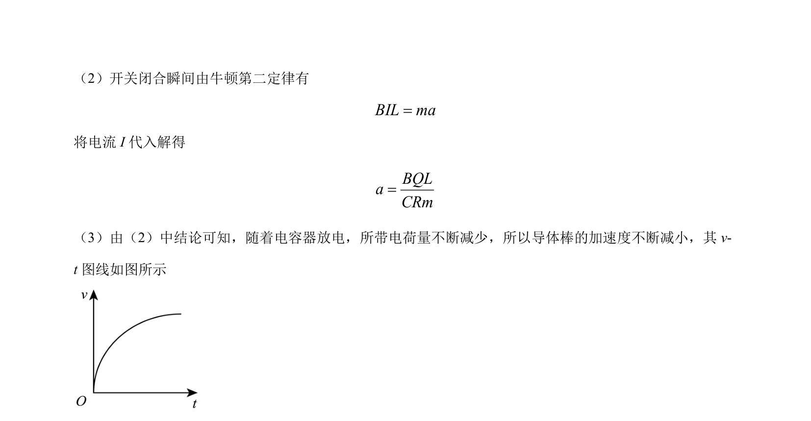

## 题面

## 摘要

电容器放电驱动导体棒在磁场中运动，分析电流、加速度及速度变化

## 关联考点

- [[313-电容器|电容器]]
- [[188-磁场对通电导体的作用|安培力]]
- [[229-牛顿第二定律|牛顿第二定律]]
- [[332-闭合电路欧姆定律|闭合电路欧姆定律]]

## 答案与解析

> 📄 原 PDF 第 15 页：`素材/真题/北京/2008-2024·（北京）物理高考真题/2024年高考物理试卷（北京）（解析卷）.pdf`
