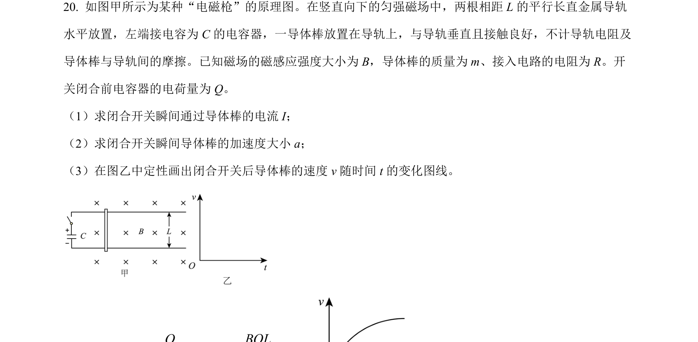
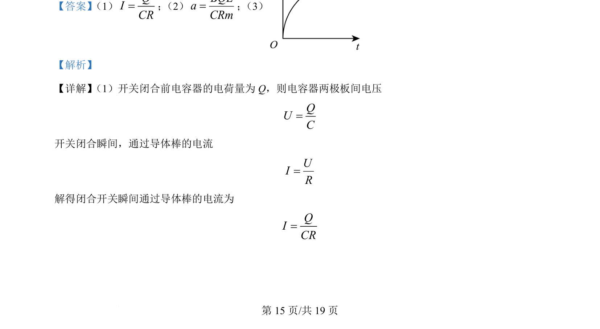
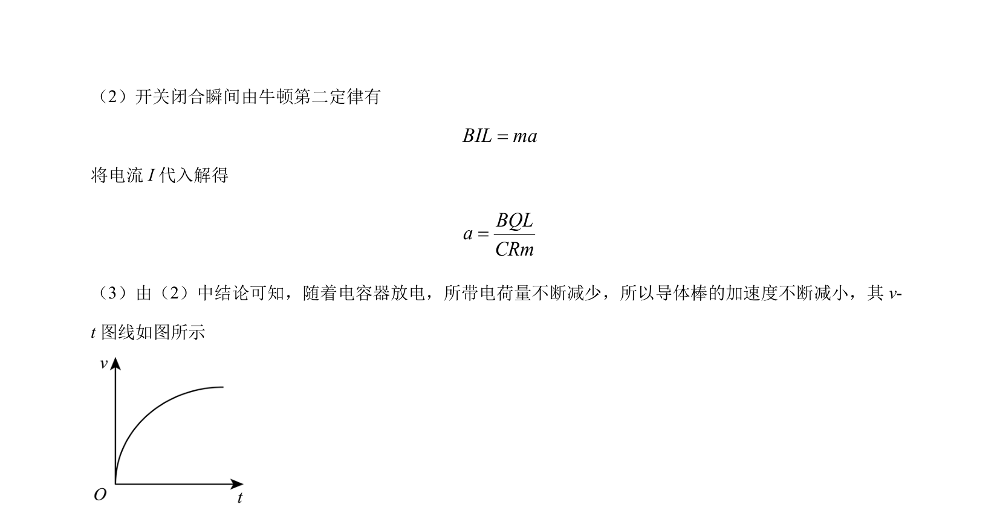

## 题面

## 摘要

电容器放电驱动导体棒在磁场中运动，分析电流、加速度及速度变化

## 关联考点

- [[313-电容器|电容器]]
- [[188-磁场对通电导体的作用|安培力]]
- [[229-牛顿第二定律|牛顿第二定律]]
- [[332-闭合电路欧姆定律|闭合电路欧姆定律]]

## 答案与解析

> 📄 原 PDF 第 15 页：`素材/真题/北京/2008-2024·（北京）物理高考真题/2024年高考物理试卷（北京）（解析卷）.pdf`

<!-- 题干文本-start -->
## 题干文本
20. 如图甲所示为某种“电磁枪”的原理图。在竖直向下的匀强磁场中，两根相距 L 的平行长直金属导轨
水平放置，左端接电容为 C的电容器，一导体棒放置在导轨上，与导轨垂直且接触良好，不计导轨电阻及
导体棒与导轨间的摩擦。已知磁场的磁感应强度大小为 B，导体棒的质量为 m、接入电路的电阻为 R。开
关闭合前电容器的电荷量为 Q。
（1）求闭合开关瞬间通过导体棒的电流 I；
（2）求闭合开关瞬间导体棒的加速度大小 a；
（3）在图乙中定性画出闭合开关后导体棒的速度 v随时间 t的变化图线。
<!-- 题干文本-end -->

<!-- 解析文本-start -->
## 解析文本
【答案】 （1）QICR=； （2）BQLaCRm=； （3）
【解析】
【详解】 （1）开关闭合前电容器的电荷量为 Q，则电容器两极板间电压
QUC=
开关闭合瞬间，通过导体棒的电流
UIR=
解得闭合开关瞬间通过导体棒的电流为
QICR=
<!-- 解析文本-end -->
