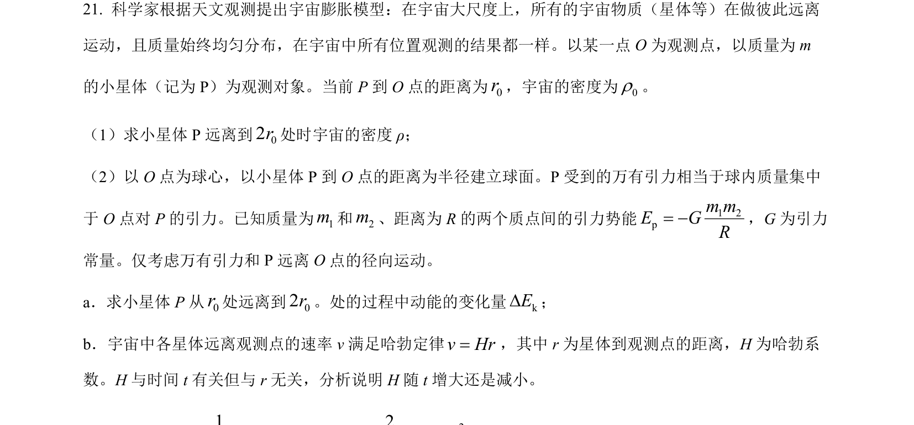
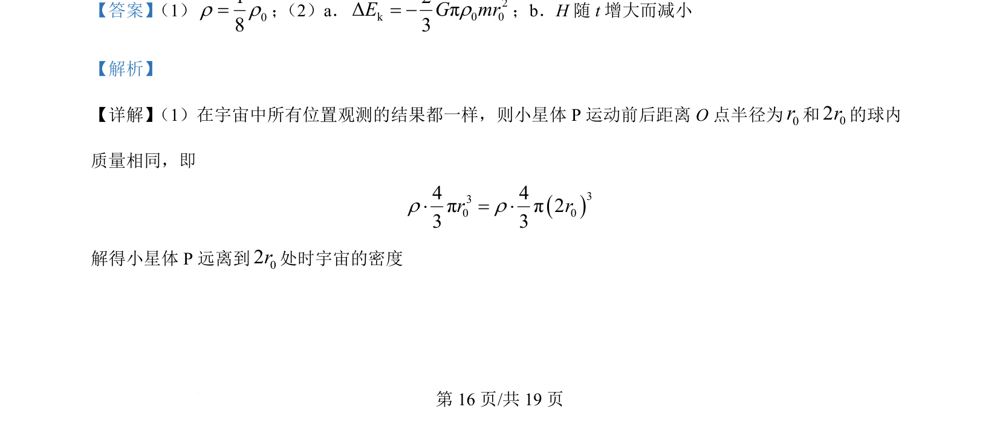
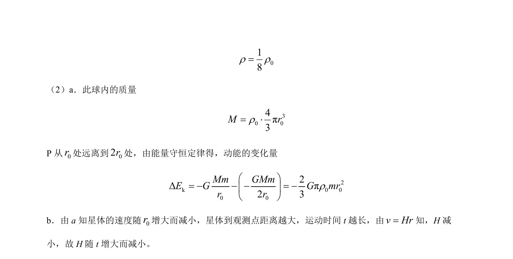

## 题面

## 摘要

该题考查宇宙膨胀背景下星体运动，结合密度、万有引力与能量守恒推导动能变化及哈勃参数演化。

## 关联考点

- [[246-万有引力定律|万有引力定律]]
- [[197-能量守恒定律|能量守恒定律]]
- [[宇宙膨胀]]
- [[哈勃定律]]

## 答案与解析

> 📄 原 PDF 第 16 页：`素材/真题/北京/2008-2024·（北京）物理高考真题/2024年高考物理试卷（北京）（解析卷）.pdf`
