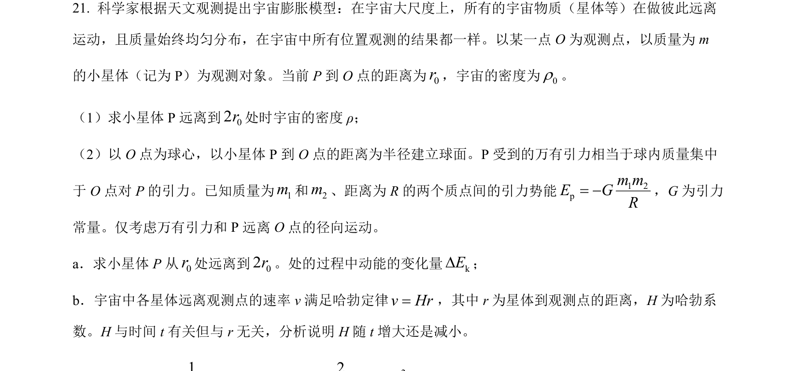
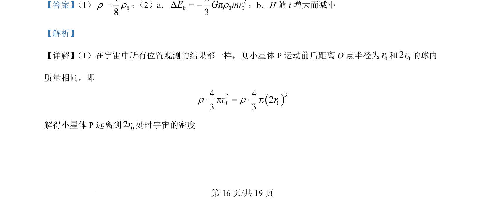
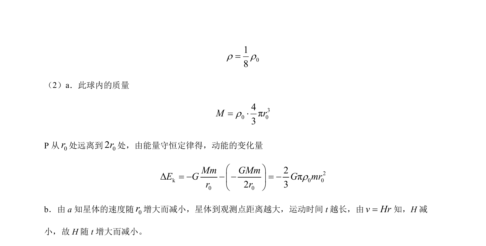

## 题面

## 摘要

该题考查宇宙膨胀背景下星体运动，结合密度、万有引力与能量守恒推导动能变化及哈勃参数演化。

## 关联考点

- [[246-万有引力定律|万有引力定律]]
- [[197-能量守恒定律|能量守恒定律]]
- [[宇宙膨胀]]
- [[哈勃定律]]

## 答案与解析

> 📄 原 PDF 第 16 页：`素材/真题/北京/2008-2024·（北京）物理高考真题/2024年高考物理试卷（北京）（解析卷）.pdf`

<!-- 题干文本-start -->
## 题干文本
21. 科学家根据天文观测提出宇宙膨胀模型：在宇宙大尺度上，所有的宇宙物质（星体等）在做彼此远离
运动，且质量始终均匀分布，在宇宙中所有位置观测的结果都一样。以某一点 O 为观测点，以质量为 m
的小星体（记为 P）为观测对象。当前 P到 O 点的距离为0r，宇宙的密度为0r。
（1）求小星体 P 远离到02r处时宇宙的密度 ρ；
（2）以 O 点为球心，以小星体 P 到 O 点的距离为半径建立球面。P 受到的万有引力相当于球内质量集中
于 O 点对 P的引力。已知质量为1m和2m、距离为 R的两个质点间的引力势能 1 2pm mE GR= -，G 为引力
常量。仅考虑万有引力和 P 远离 O 点的径向运动。
a．求小星体 P从0r处远离到02r。处的过程中动能的变化量kED；
b．宇宙中各星体远离观测点的速率 v满足哈勃定律v Hr=，其中 r 为星体到观测点的距离，H 为哈勃系
数。H 与时间 t有关但与 r 无关，分析说明 H 随 t增大还是减小。
<!-- 题干文本-end -->

<!-- 解析文本-start -->
## 解析文本
【答案】 （1） 018r r=； （2）a． 2k 0 02Δπ3E G mrr= -；b．H 随 t增大而减小
【解析】
【详解】 （1）在宇宙中所有位置观测的结果都一样，则小星体 P 运动前后距离 O 点半径为0r和02r的球内
质量相同，即
()330 04 4ππ23 3r rr r× = ×
解得小星体 P 远离到02r处时宇宙的密度
<!-- 解析文本-end -->
