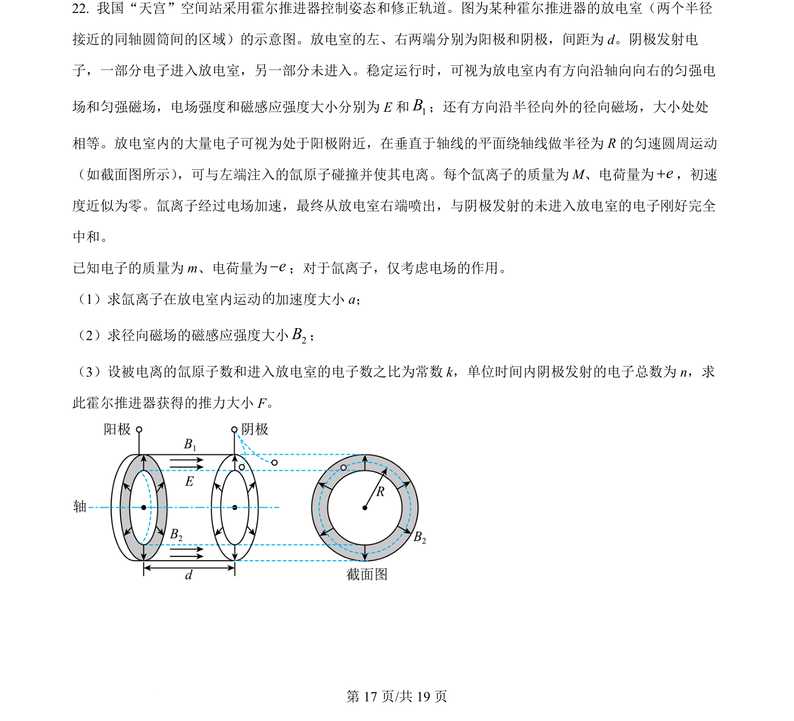
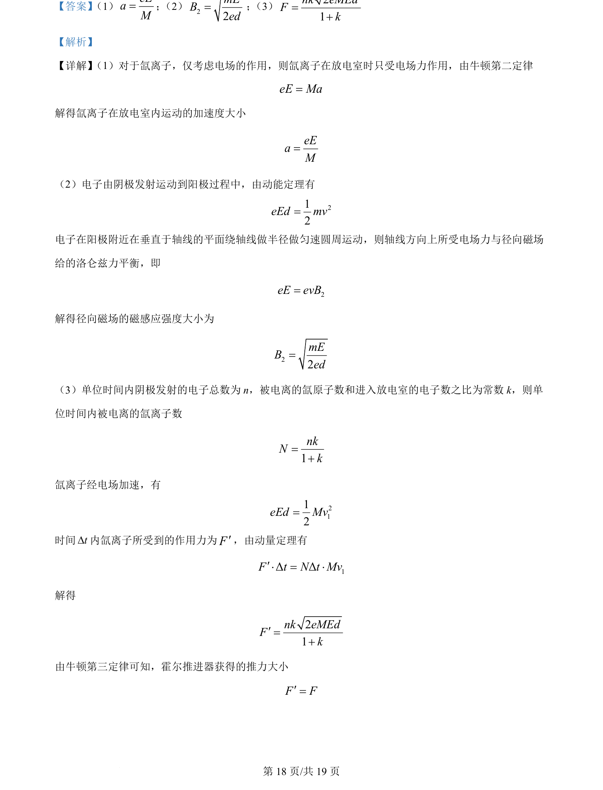
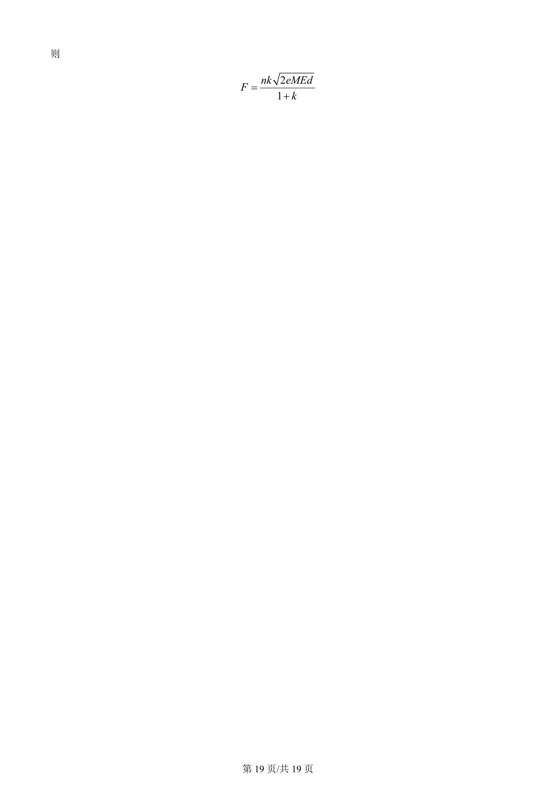

## 题面

## 摘要

本题综合考查电场加速、磁场中的洛伦兹力平衡、动能定理及动量定理在霍尔推进器推力计算中的应用。

## 关联考点

- [[229-牛顿第二定律|牛顿第二定律]]
- [[251-动能定理|动能定理]]
- [[304-洛伦兹力|洛伦兹力]]
- [[349-动量定理|动量定理]]

## 答案与解析

> 📄 原 PDF 第 17 页：`素材/真题/北京/2008-2024·（北京）物理高考真题/2024年高考物理试卷（北京）（解析卷）.pdf`
