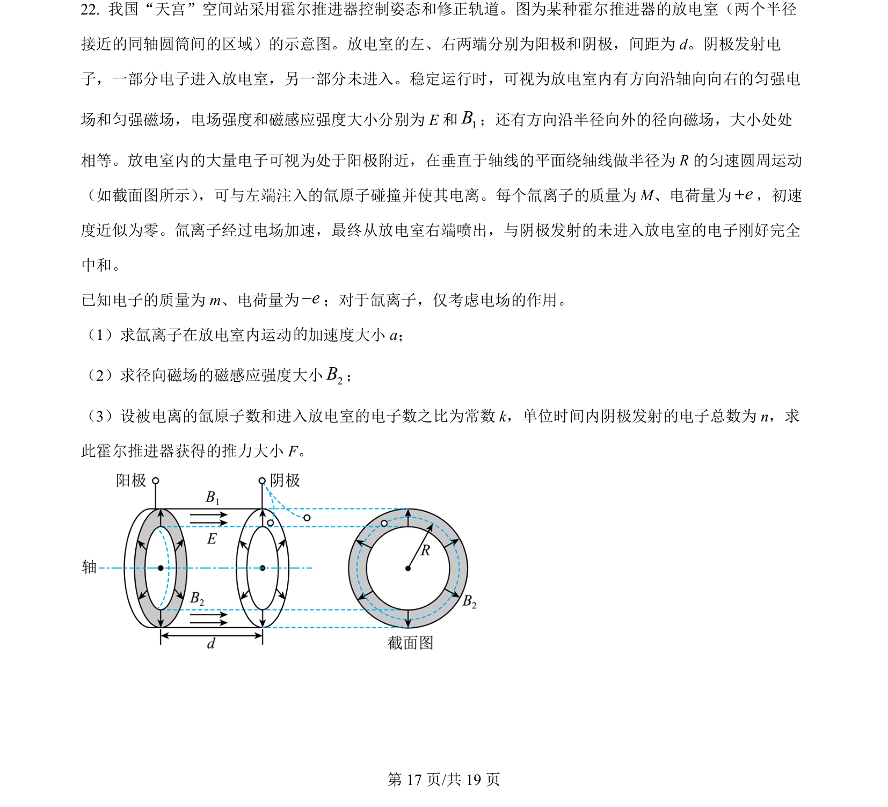
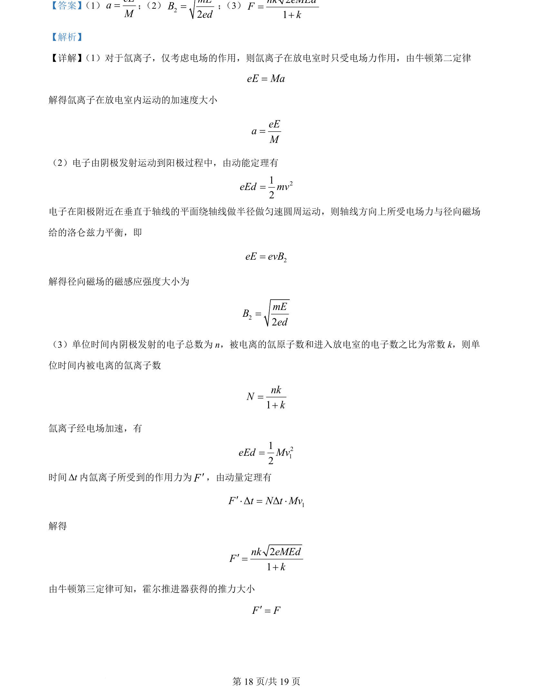
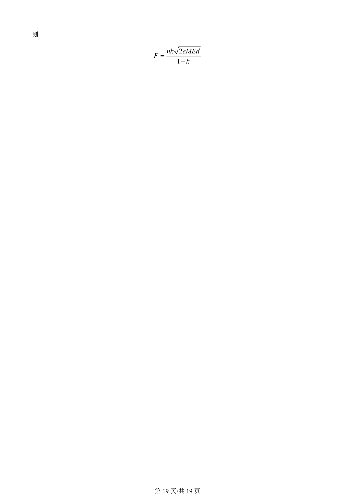

## 题面

## 摘要

本题综合考查电场加速、磁场中的洛伦兹力平衡、动能定理及动量定理在霍尔推进器推力计算中的应用。

## 关联考点

- [[229-牛顿第二定律|牛顿第二定律]]
- [[251-动能定理|动能定理]]
- [[304-洛伦兹力|洛伦兹力]]
- [[349-动量定理|动量定理]]

## 答案与解析

> 📄 原 PDF 第 17 页：`素材/真题/北京/2008-2024·（北京）物理高考真题/2024年高考物理试卷（北京）（解析卷）.pdf`

<!-- 题干文本-start -->
## 题干文本
22. 我国“天宫”空间站采用霍尔推进器控制姿态和修正轨道。图为某种霍尔推进器的放电室（两个半径
接近的同轴圆筒间的区域）的示意图。放电室的左、右两端分别为阳极和阴极，间距为 d。阴极发射电
子，一部分电子进入放电室，另一部分未进入。稳定运行时，可视为放电室内有方向沿轴向向右的匀强电
场和匀强磁场，电场强度和磁感应强度大小分别为 E和1B；还有方向沿半径向外的径向磁场，大小处处
相等。放电室内的大量电子可视为处于阳极附近，在垂直于轴线的平面绕轴线做半径为 R的匀速圆周运动
（如截面图所示） ，可与左端注入的氙原子碰撞并使其电离。每个氙离子的质量为M、电荷量为e+，初速
度近似为零。氙离子经过电场加速，最终从放电室右端喷出，与阴极发射的未进入放电室的电子刚好完全
中和。
已知电子的质量为 m、电荷量为e-；对于氙离子，仅考虑电场的作用。
（1）求氙离子在放电室内运动 加速度大小 a；
（2）求径向磁场的磁感应强度大小2B；
（3）设被电离的氙原子数和进入放电室的电子数之比为常数 k，单位时间内阴极发射的电子总数为 n，求
此霍尔推进器获得的推力大小 F。
的
<!-- 题干文本-end -->

<!-- 解析文本-start -->
## 解析文本

<!-- 解析文本-end -->
