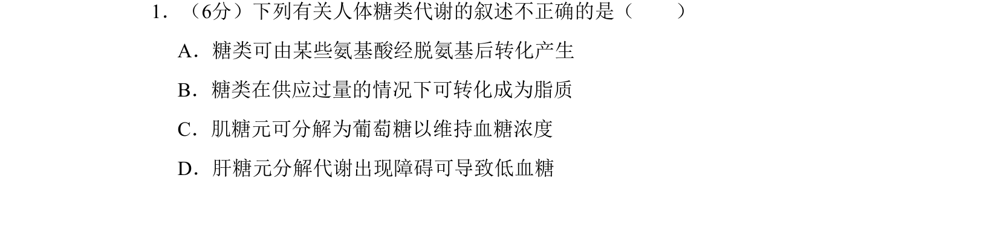
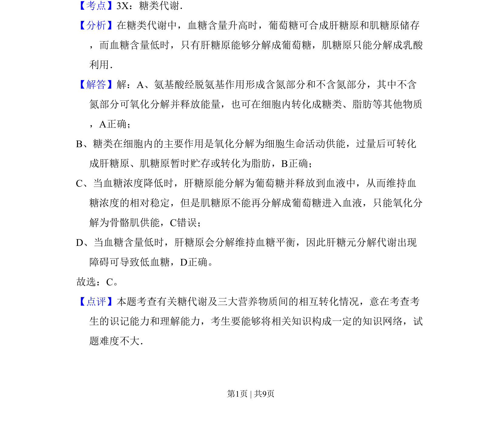

## 题面

## 摘要

糖类代谢中糖类与氨基酸、脂质的转化以及肝糖原与肌糖原在维持血糖浓度中的作用辨析。

## 关联考点

- [[673-糖类代谢|糖类代谢]]
- [[512-血糖调节|血糖调节]]
- [[肝糖原]]
- [[肌糖原]]

## 答案与解析

> 📄 原 PDF 第 1 页：`素材/真题/北京/2008-2024·（北京）生物高考真题/2008年高考生物试卷（北京）（解析卷）.pdf`
