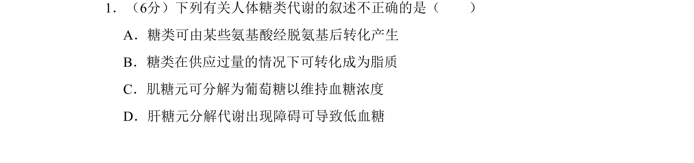
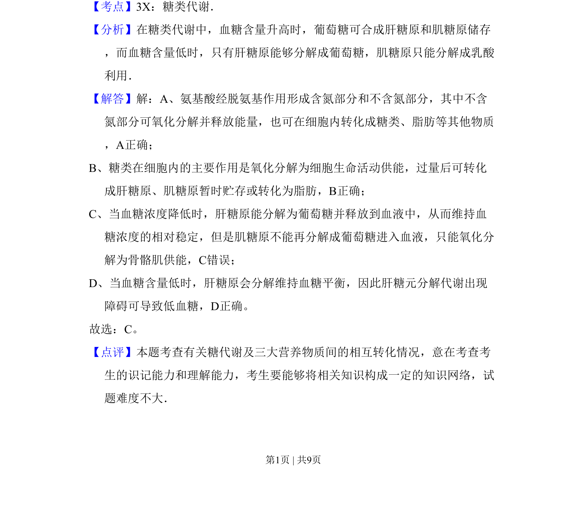

## 题面

## 摘要

糖类代谢中糖类与氨基酸、脂质的转化以及肝糖原与肌糖原在维持血糖浓度中的作用辨析。

## 关联考点

- [[673-糖类代谢|糖类代谢]]
- [[512-血糖调节|血糖调节]]
- [[肝糖原]]
- [[肌糖原]]

## 答案与解析

> 📄 原 PDF 第 1 页：`素材/真题/北京/2008-2024·（北京）生物高考真题/2008年高考生物试卷（北京）（解析卷）.pdf`

<!-- 题干文本-start -->
## 题干文本
1．（6分）下列有关人体糖类代谢的叙述不正确的是（　　）
A．糖类可由某些氨基酸经脱氨基后转化产生
B．糖类在供应过量的情况下可转化成为脂质
C．肌糖元可分解为葡萄糖以维持血糖浓度
D．肝糖元分解代谢出现障碍可导致低血糖
<!-- 题干文本-end -->

<!-- 解析文本-start -->
## 解析文本
【考点】3X：糖类代谢．菁优网版权所有
【分析】在糖类代谢中，血糖含量升高时，葡萄糖可合成肝糖原和肌糖原储存
，而血糖含量低时，只有肝糖原能够分解成葡萄糖，肌糖原只能分解成乳酸
利用．
【解答】解：A、氨基酸经脱氨基作用形成含氮部分和不含氮部分，其中不含
氮部分可氧化分解并释放能量，也可在细胞内转化成糖类、脂肪等其他物质
，A正确；
B、糖类在细胞内的主要作用是氧化分解为细胞生命活动供能，过量后可转化
成肝糖原、肌糖原暂时贮存或转化为脂肪，B正确；
C、当血糖浓度降低时，肝糖原能分解为葡萄糖并释放到血液中，从而维持血
糖浓度的相对稳定，但是肌糖原不能再分解成葡萄糖进入血液，只能氧化分
解为骨骼肌供能，C错误；
D、当血糖含量低时，肝糖原会分解维持血糖平衡，因此肝糖元分解代谢出现
障碍可导致低血糖，D正确。
故选：C。
【点评】本题考查有关糖代谢及三大营养物质间的相互转化情况，意在考查考
生的识记能力和理解能力，考生要能够将相关知识构成一定的知识网络，试
题难度不大．
<!-- 解析文本-end -->
