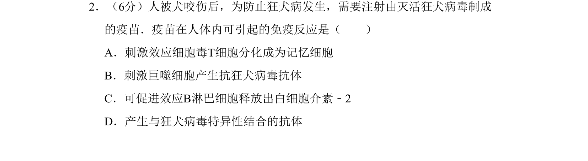
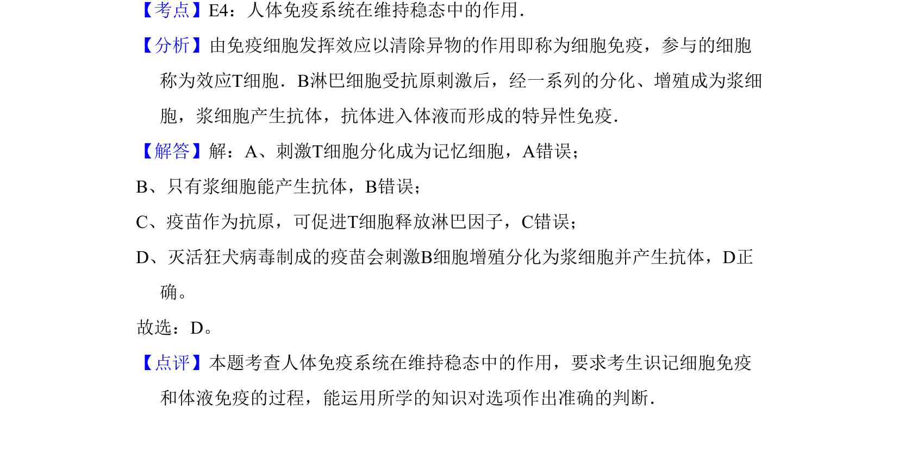

## 题面

## 摘要

注射灭活疫苗引发体液免疫，刺激B细胞增殖分化为浆细胞产生特异性抗体。

## 关联考点

- [[353-体液免疫|体液免疫]]
- [[162-抗体|抗体]]
- [[B淋巴细胞]]
- [[898-疫苗|疫苗]]

## 答案与解析

> 📄 原 PDF 第 2 页：`素材/真题/北京/2008-2024·（北京）生物高考真题/2008年高考生物试卷（北京）（解析卷）.pdf`
