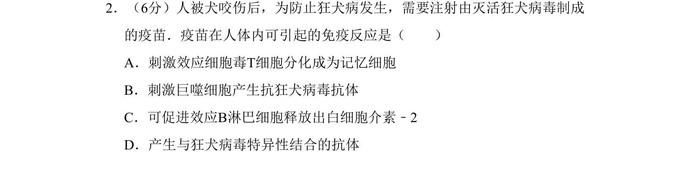
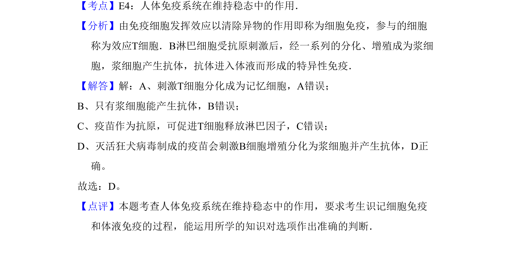

## 题面

## 摘要

注射灭活疫苗引发体液免疫，刺激B细胞增殖分化为浆细胞产生特异性抗体。

## 关联考点

- [[353-体液免疫|体液免疫]]
- [[162-抗体|抗体]]
- [[B淋巴细胞]]
- [[898-疫苗|疫苗]]

## 答案与解析

> 📄 原 PDF 第 2 页：`素材/真题/北京/2008-2024·（北京）生物高考真题/2008年高考生物试卷（北京）（解析卷）.pdf`

<!-- 题干文本-start -->
## 题干文本
2．（6分）人被犬咬伤后，为防止狂犬病发生，需要注射由灭活狂犬病毒制成
的疫苗．疫苗在人体内可引起的免疫反应是（　　）
A．刺激效应细胞毒T细胞分化成为记忆细胞
B．刺激巨噬细胞产生抗狂犬病毒抗体
C．可促进效应B淋巴细胞释放出白细胞介素﹣2
D．产生与狂犬病毒特异性结合的抗体
<!-- 题干文本-end -->

<!-- 解析文本-start -->
## 解析文本
【考点】E4：人体免疫系统在维持稳态中的作用．菁优网版权所有
【分析】由免疫细胞发挥效应以清除异物的作用即称为细胞免疫，参与的细胞
称为效应T细胞．B淋巴细胞受抗原刺激后，经一系列的分化、增殖成为浆细
胞，浆细胞产生抗体，抗体进入体液而形成的特异性免疫．
【解答】解：A、刺激T细胞分化成为记忆细胞，A错误；
B、只有浆细胞能产生抗体，B错误；
C、疫苗作为抗原，可促进T细胞释放淋巴因子，C错误；
D、灭活狂犬病毒制成的疫苗会刺激B细胞增殖分化为浆细胞并产生抗体，D正
确。
故选：D。
【点评】本题考查人体免疫系统在维持稳态中的作用，要求考生识记细胞免疫
和体液免疫的过程，能运用所学的知识对选项作出准确的判断．
<!-- 解析文本-end -->
