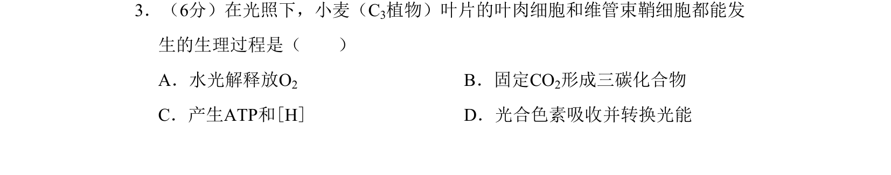
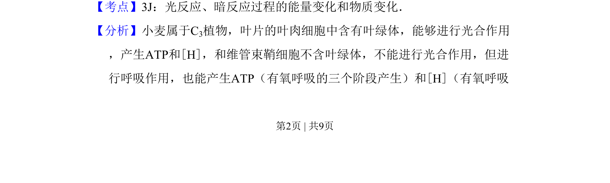
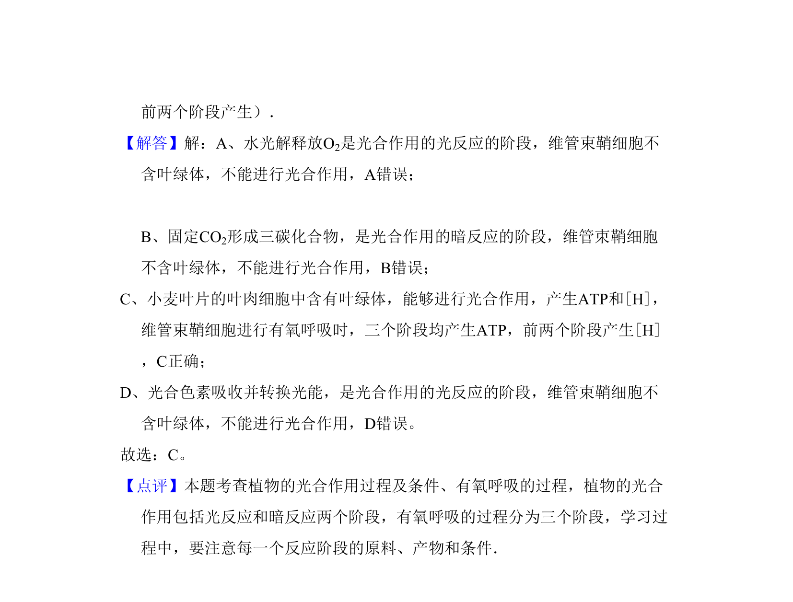

## 题面

## 摘要

本题考查C3植物叶肉细胞与维管束鞘细胞在光照下的代谢过程异同。

## 关联考点

- [[C3植物]]
- [[033-光合作用|光合作用]]
- [[031-呼吸作用|呼吸作用]]
- [[ATP与[H]产生]]

## 答案与解析

> 📄 原 PDF 第 2 页：`素材/真题/北京/2008-2024·（北京）生物高考真题/2008年高考生物试卷（北京）（解析卷）.pdf`
