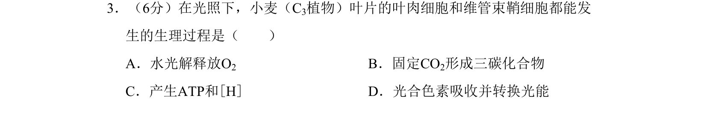
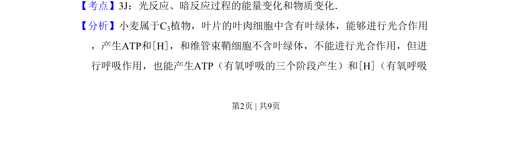
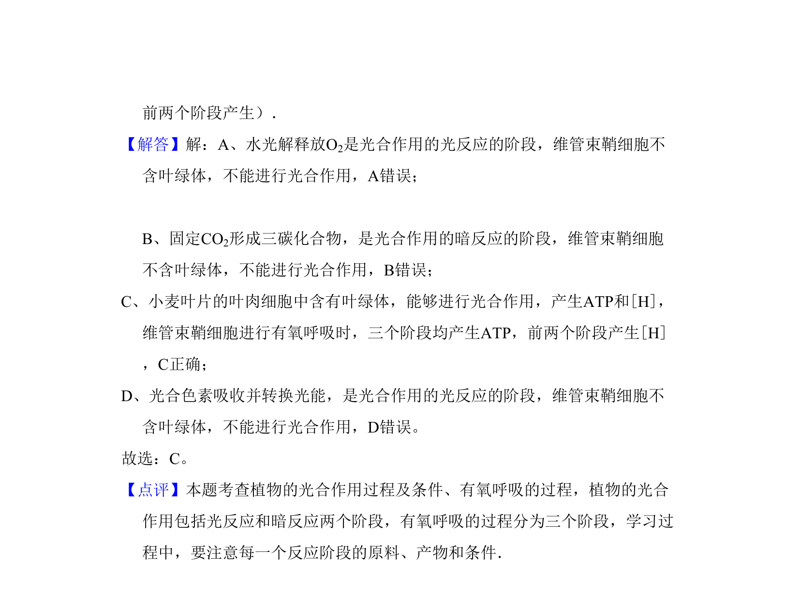

## 题面

## 摘要

本题考查C3植物叶肉细胞与维管束鞘细胞在光照下的代谢过程异同。

## 关联考点

- [[C3植物]]
- [[033-光合作用|光合作用]]
- [[031-呼吸作用|呼吸作用]]
- [[ATP与[H]产生]]

## 答案与解析

> 📄 原 PDF 第 2 页：`素材/真题/北京/2008-2024·（北京）生物高考真题/2008年高考生物试卷（北京）（解析卷）.pdf`

<!-- 题干文本-start -->
## 题干文本
3．（6分）在光照下，小麦（C3植物）叶片的叶肉细胞和维管束鞘细胞都能发
生的生理过程是（　　）
A．水光解释放O2 B．固定CO2形成三碳化合物
C．产生ATP和[H]D．光合色素吸收并转换光能
<!-- 题干文本-end -->

<!-- 解析文本-start -->
## 解析文本
【考点】3J：光反应、暗反应过程的能量变化和物质变化．菁优网版权所有
【分析】小麦属于C3植物，叶片的叶肉细胞中含有叶绿体，能够进行光合作用
，产生ATP和[H]，和维管束鞘细胞不含叶绿体，不能进行光合作用，但进
行呼吸作用，也能产生ATP（有氧呼吸的三个阶段产生）和[H]（有氧呼吸
<!-- 解析文本-end -->
