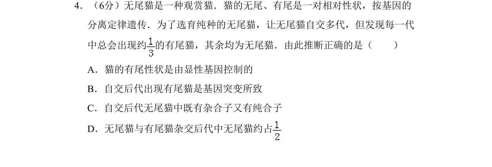
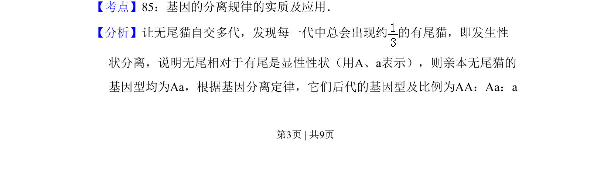
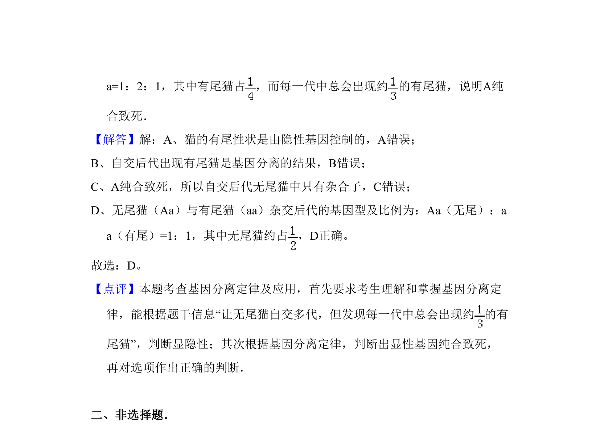

## 题面

## 摘要

通过无尾猫自交后代性状分离现象推断显隐性和基因型比例。

## 关联考点

- [[266-分离定律|基因的分离定律]]
- [[600-性状分离|性状分离]]
- [[显隐性关系]]
- [[576-基因型推断|基因型推断]]

## 答案与解析

> 📄 原 PDF 第 3 页：`素材/真题/北京/2008-2024·（北京）生物高考真题/2008年高考生物试卷（北京）（解析卷）.pdf`
