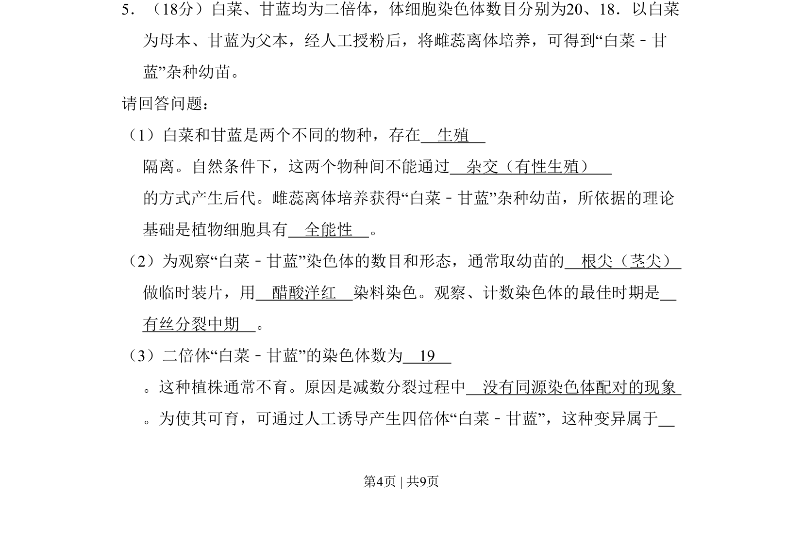
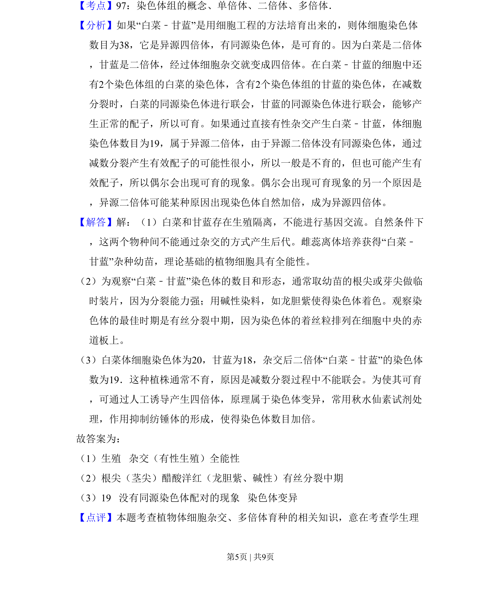

## 题面

## 摘要

考查白菜-甘蓝杂交实验，涉及生殖隔离、植物组织培养、染色体观察及多倍体育种等知识。

## 关联考点

- [[897-生殖隔离|生殖隔离]]
- [[249-细胞全能性|细胞全能性]]
- [[有丝分裂中期]]
- [[304-染色体变异|染色体变异]]

## 答案与解析

> 📄 原 PDF 第 4 页：`素材/真题/北京/2008-2024·（北京）生物高考真题/2008年高考生物试卷（北京）（解析卷）.pdf`
