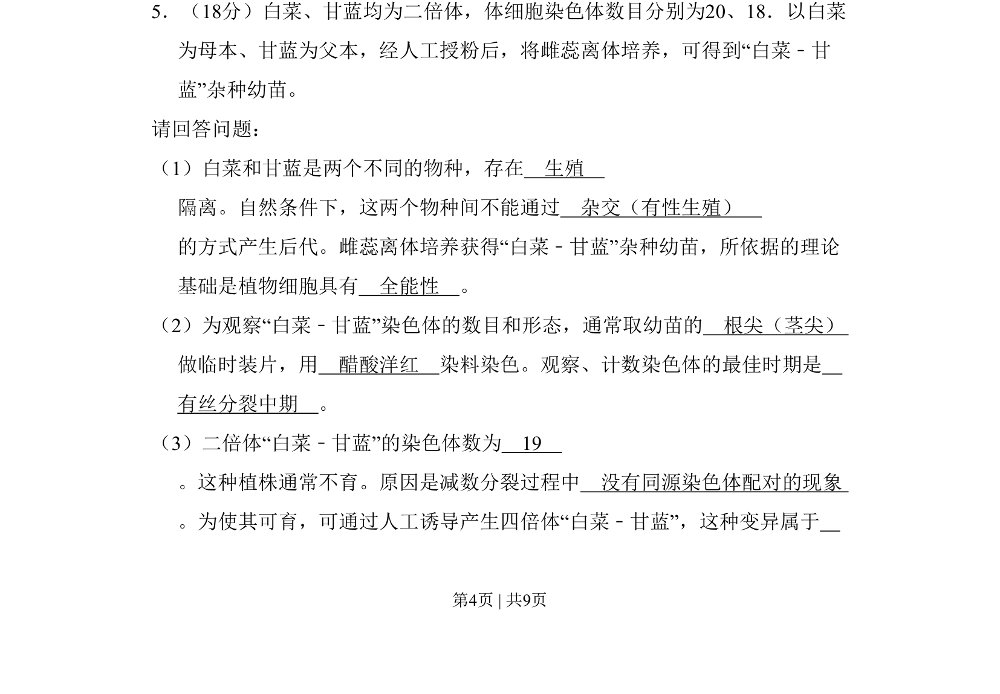
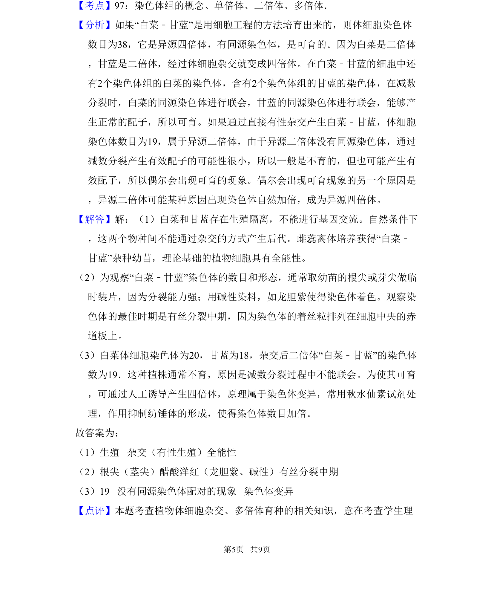

## 题面

## 摘要

考查白菜-甘蓝杂交实验，涉及生殖隔离、植物组织培养、染色体观察及多倍体育种等知识。

## 关联考点

- [[897-生殖隔离|生殖隔离]]
- [[249-细胞全能性|细胞全能性]]
- [[有丝分裂中期]]
- [[304-染色体变异|染色体变异]]

## 答案与解析

> 📄 原 PDF 第 4 页：`素材/真题/北京/2008-2024·（北京）生物高考真题/2008年高考生物试卷（北京）（解析卷）.pdf`

<!-- 题干文本-start -->
## 题干文本
5．（18分）白菜、甘蓝均为二倍体，体细胞染色体数目分别为20、18．以白菜
为母本、甘蓝为父本，经人工授粉后，将雌蕊离体培养，可得到“白菜﹣甘
蓝”杂种幼苗。
请回答问题：
（1）白菜和甘蓝是两个不同的物种，存在　生殖　
隔离。自然条件下，这两个物种间不能通过　杂交（有性生殖）　
的方式产生后代。雌蕊离体培养获得“白菜﹣甘蓝”杂种幼苗，所依据的理论
基础是植物细胞具有　全能性　。
（2）为观察“白菜﹣甘蓝”染色体的数目和形态，通常取幼苗的　根尖（茎尖）　
做临时装片，用　醋酸洋红　染料染色。观察、计数染色体的最佳时期是　
有丝分裂中期　。
（3）二倍体“白菜﹣甘蓝”的染色体数为　19　
。这种植株通常不育。原因是减数分裂过程中　没有同源染色体配对的现象　
。为使其可育，可通过人工诱导产生四倍体“白菜﹣甘蓝”，这种变异属于
<!-- 题干文本-end -->

<!-- 解析文本-start -->
## 解析文本

<!-- 解析文本-end -->
