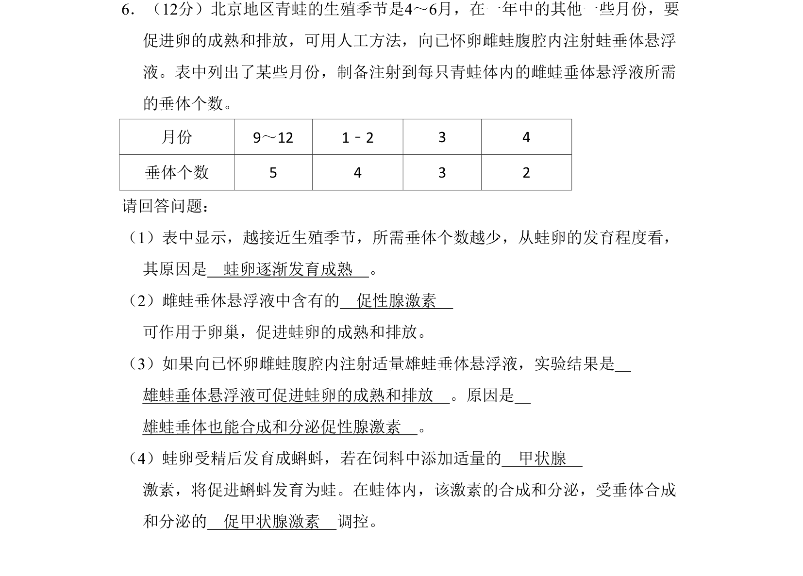
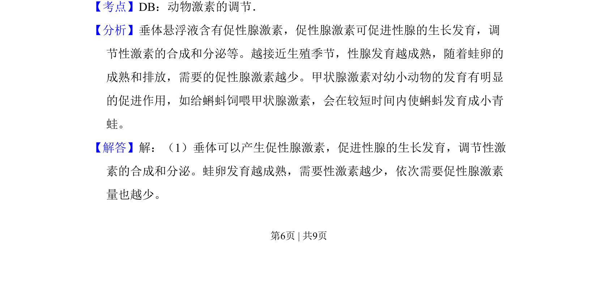
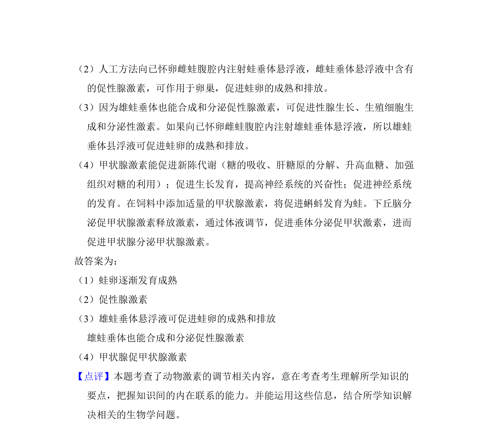

## 题面

## 摘要

该题通过青蛙生殖实验考查动物激素的调节作用，涉及数据分析与实验推断。

## 关联考点

- [[786-动物激素调节|动物激素调节]]
- [[促性腺激素]]
- [[338-甲状腺激素|甲状腺激素]]
- [[745-促甲状腺激素|促甲状腺激素]]

## 答案与解析

> 📄 原 PDF 第 6 页：`素材/真题/北京/2008-2024·（北京）生物高考真题/2008年高考生物试卷（北京）（解析卷）.pdf`
