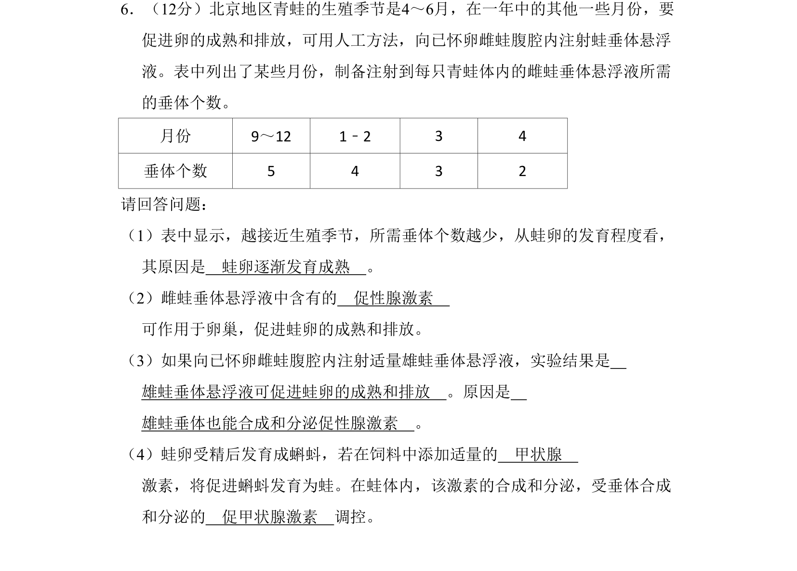
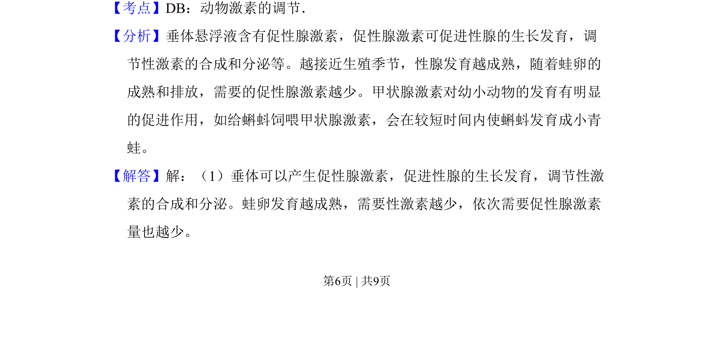
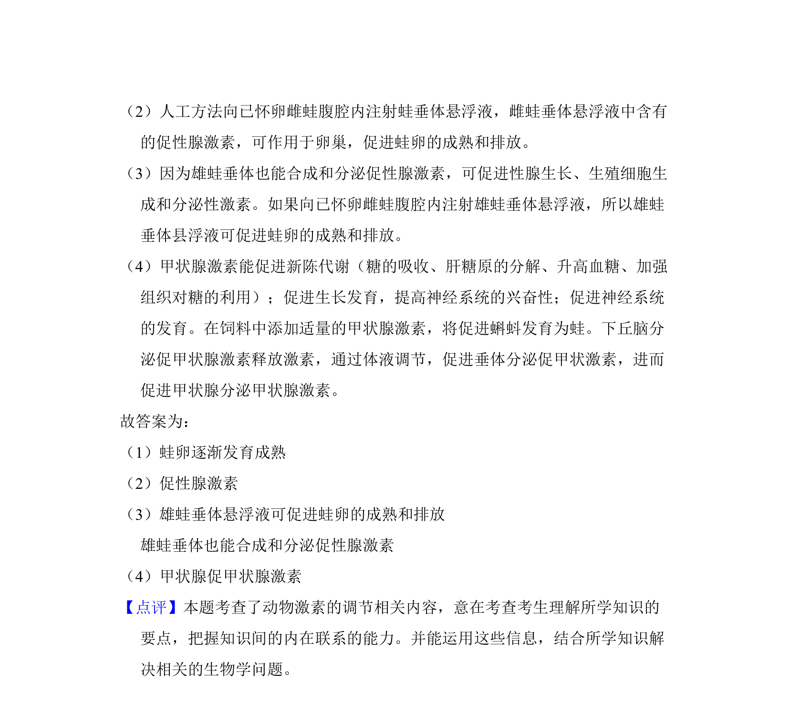

## 题面

## 摘要

该题通过青蛙生殖实验考查动物激素的调节作用，涉及数据分析与实验推断。

## 关联考点

- [[786-动物激素调节|动物激素调节]]
- [[促性腺激素]]
- [[338-甲状腺激素|甲状腺激素]]
- [[745-促甲状腺激素|促甲状腺激素]]

## 答案与解析

> 📄 原 PDF 第 6 页：`素材/真题/北京/2008-2024·（北京）生物高考真题/2008年高考生物试卷（北京）（解析卷）.pdf`

<!-- 题干文本-start -->
## 题干文本
6．（12分）北京地区青蛙的生殖季节是4～6月，在一年中的其他一些月份，要
促进卵的成熟和排放，可用人工方法，向已怀卵雌蛙腹腔内注射蛙垂体悬浮
液。表中列出了某些月份，制备注射到每只青蛙体内的雌蛙垂体悬浮液所需
的垂体个数。
月份 9～12 1﹣2 3 4
垂体个数 5 4 3 2
请回答问题：
（1）表中显示，越接近生殖季节，所需垂体个数越少，从蛙卵的发育程度看，
其原因是　蛙卵逐渐发育成熟　。
（2）雌蛙垂体悬浮液中含有的　促性腺激素　
可作用于卵巢，促进蛙卵的成熟和排放。
（3）如果向已怀卵雌蛙腹腔内注射适量雄蛙垂体悬浮液，实验结果是　
雄蛙垂体悬浮液可促进蛙卵的成熟和排放　。原因是　
雄蛙垂体也能合成和分泌促性腺激素　。
（4）蛙卵受精后发育成蝌蚪，若在饲料中添加适量的　甲状腺　
激素，将促进蝌蚪发育为蛙。在蛙体内，该激素的合成和分泌，受垂体合成
和分泌的　促甲状腺激素　调控。
<!-- 题干文本-end -->

<!-- 解析文本-start -->
## 解析文本
【考点】DB：动物激素的调节．菁优网版权所有
【分析】垂体悬浮液含有促性腺激素，促性腺激素可促进性腺的生长发育，调
节性激素的合成和分泌等。越接近生殖季节，性腺发育越成熟，随着蛙卵的
成熟和排放，需要的促性腺激素越少。甲状腺激素对幼小动物的发育有明显
的促进作用，如给蝌蚪饲喂甲状腺激素，会在较短时间内使蝌蚪发育成小青
蛙。
【解答】解：（1）垂体可以产生促性腺激素，促进性腺的生长发育，调节性激
素的合成和分泌。蛙卵发育越成熟，需要性激素越少，依次需要促性腺激素
量也越少。
<!-- 解析文本-end -->
