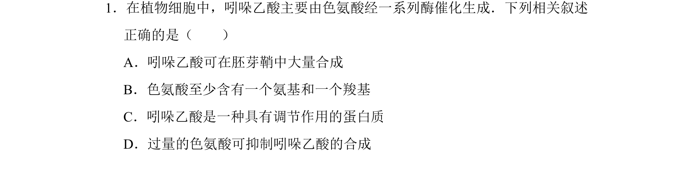
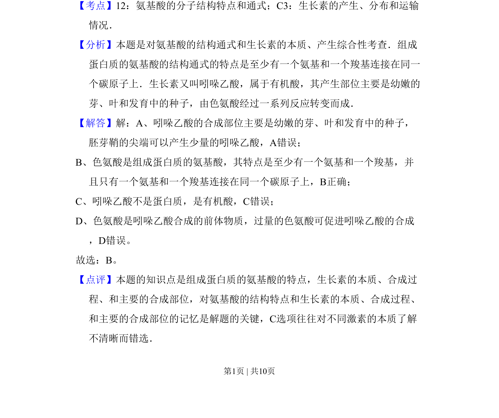

## 题面

## 摘要

本题通过吲哚乙酸的合成考查氨基酸结构通式和生长素的本质、合成部位。

## 关联考点

- [[氨基酸的分子结构特点和通式]]
- [[生长素的产生]]
- [[分布和运输情况]]

## 答案与解析

> 📄 原 PDF 第 1 页：`素材/真题/北京/2008-2024·（北京）生物高考真题/2009年高考生物试卷（北京）（解析卷）.pdf`

<!-- 题干文本-start -->
## 题干文本
1．在植物细胞中，吲哚乙酸主要由色氨酸经一系列酶催化生成．下列相关叙述
正确的是（　　）
A．吲哚乙酸可在胚芽鞘中大量合成
B．色氨酸至少含有一个氨基和一个羧基
C．吲哚乙酸是一种具有调节作用的蛋白质
D．过量的色氨酸可抑制吲哚乙酸的合成
<!-- 题干文本-end -->

<!-- 解析文本-start -->
## 解析文本
【考点】12：氨基酸的分子结构特点和通式；C3：生长素的产生、分布和运输
情况．菁优网版权所有
【分析】本题是对氨基酸的结构通式和生长素的本质、产生综合性考查．组成
蛋白质的氨基酸的结构通式的特点是至少有一个氨基和一个羧基连接在同一
个碳原子上．生长素又叫吲哚乙酸，属于有机酸，其产生部位主要是幼嫩的
芽、叶和发育中的种子，由色氨酸经过一系列反应转变而成．
【解答】解：A、吲哚乙酸的合成部位主要是幼嫩的芽、叶和发育中的种子，
胚芽鞘的尖端可以产生少量的吲哚乙酸，A错误；
B、色氨酸是组成蛋白质的氨基酸，其特点是至少有一个氨基和一个羧基，并
且只有一个氨基和一个羧基连接在同一个碳原子上，B正确；
C、吲哚乙酸不是蛋白质，是有机酸，C错误；
D、色氨酸是吲哚乙酸合成的前体物质，过量的色氨酸可促进吲哚乙酸的合成
，D错误。
故选：B。
【点评】本题的知识点是组成蛋白质的氨基酸的特点，生长素的本质、合成过
程、和主要的合成部位，对氨基酸的结构特点和生长素的本质、合成过程、
和主要的合成部位的记忆是解题的关键，C选项往往对不同激素的本质了解
不清晰而错选．
<!-- 解析文本-end -->
