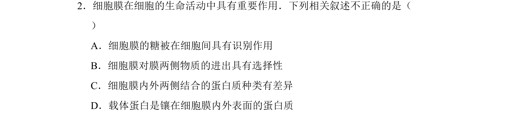
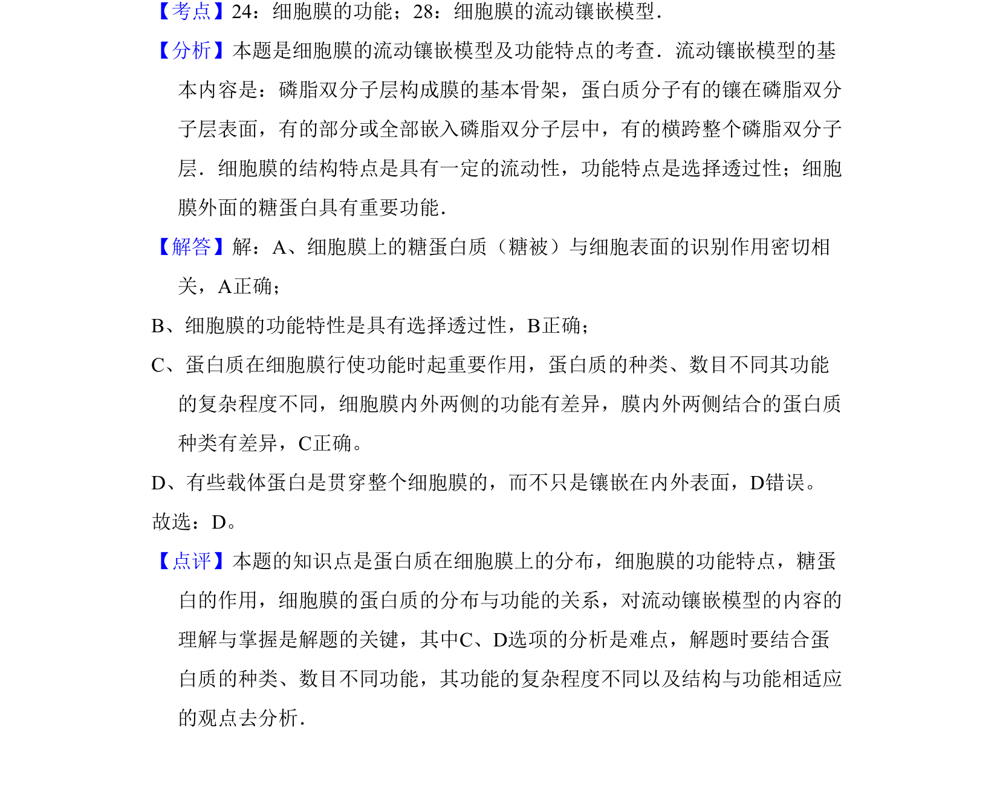

## 题面

## 摘要

该题考查细胞膜流动镶嵌模型及功能，辨析糖被识别、选择透过性及载体蛋白分布等叙述正误。

## 关联考点

- [[细胞膜功能]]
- [[226-流动镶嵌模型|流动镶嵌模型]]
- [[763-载体蛋白|载体蛋白]]
- [[糖被识别]]

## 答案与解析

> 📄 原 PDF 第 2 页：`素材/真题/北京/2008-2024·（北京）生物高考真题/2009年高考生物试卷（北京）（解析卷）.pdf`
