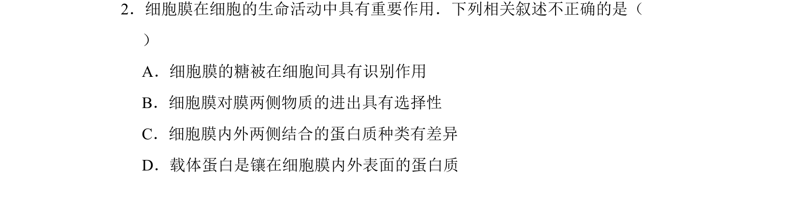
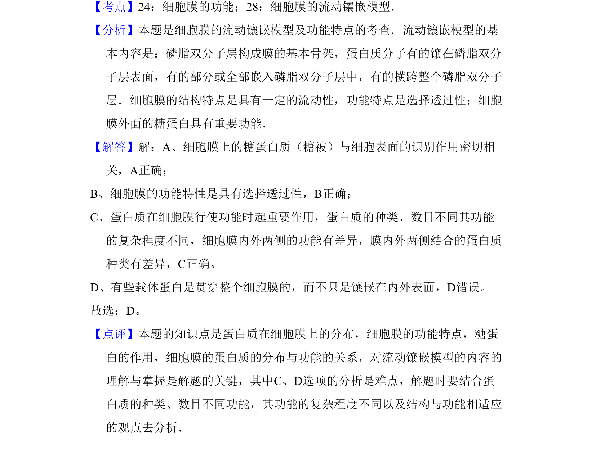

## 题面

## 摘要

该题考查细胞膜流动镶嵌模型及功能，辨析糖被识别、选择透过性及载体蛋白分布等叙述正误。

## 关联考点

- [[细胞膜功能]]
- [[226-流动镶嵌模型|流动镶嵌模型]]
- [[763-载体蛋白|载体蛋白]]
- [[糖被识别]]

## 答案与解析

> 📄 原 PDF 第 2 页：`素材/真题/北京/2008-2024·（北京）生物高考真题/2009年高考生物试卷（北京）（解析卷）.pdf`

<!-- 题干文本-start -->
## 题干文本
2．细胞膜在细胞的生命活动中具有重要作用．下列相关叙述不正确的是（　　
）
A．细胞膜的糖被在细胞间具有识别作用
B．细胞膜对膜两侧物质的进出具有选择性
C．细胞膜内外两侧结合的蛋白质种类有差异
D．载体蛋白是镶在细胞膜内外表面的蛋白质
<!-- 题干文本-end -->

<!-- 解析文本-start -->
## 解析文本
【考点】24：细胞膜的功能；28：细胞膜的流动镶嵌模型．菁优网版权所有
【分析】本题是细胞膜的流动镶嵌模型及功能特点的考查．流动镶嵌模型的基
本内容是：磷脂双分子层构成膜的基本骨架，蛋白质分子有的镶在磷脂双分
子层表面，有的部分或全部嵌入磷脂双分子层中，有的横跨整个磷脂双分子
层．细胞膜的结构特点是具有一定的流动性，功能特点是选择透过性；细胞
膜外面的糖蛋白具有重要功能．
【解答】解：A、细胞膜上的糖蛋白质（糖被）与细胞表面的识别作用密切相
关，A正确；
B、细胞膜的功能特性是具有选择透过性，B正确；
C、蛋白质在细胞膜行使功能时起重要作用，蛋白质的种类、数目不同其功能
的复杂程度不同，细胞膜内外两侧的功能有差异，膜内外两侧结合的蛋白质
种类有差异，C正确。
D、有些载体蛋白是贯穿整个细胞膜的，而不只是镶嵌在内外表面，D错误。
故选：D。
【点评】本题的知识点是蛋白质在细胞膜上的分布，细胞膜的功能特点，糖蛋
白的作用，细胞膜的蛋白质的分布与功能的关系，对流动镶嵌模型的内容的
理解与掌握是解题的关键，其中C、D选项的分析是难点，解题时要结合蛋
白质的种类、数目不同功能，其功能的复杂程度不同以及结构与功能相适应
的观点去分析．
<!-- 解析文本-end -->
