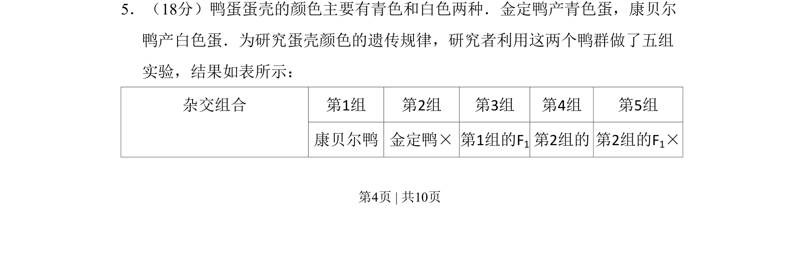
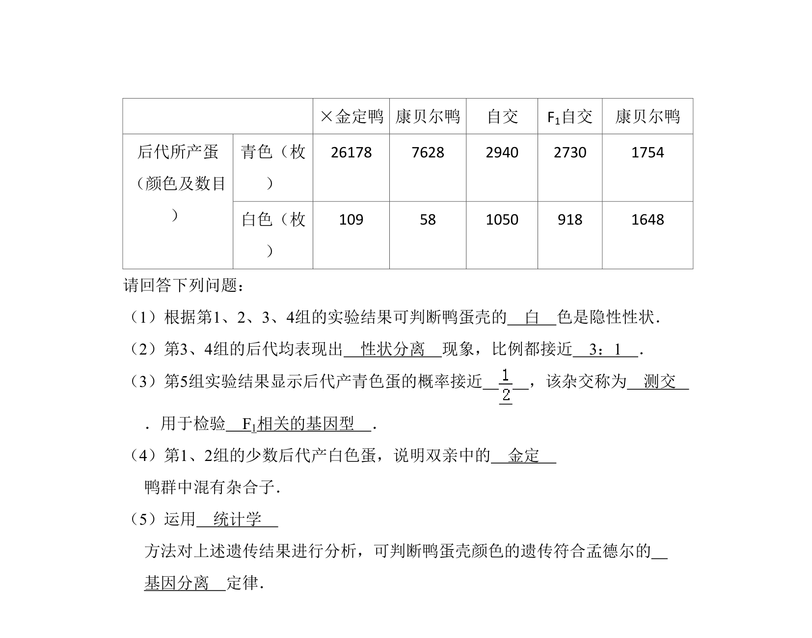
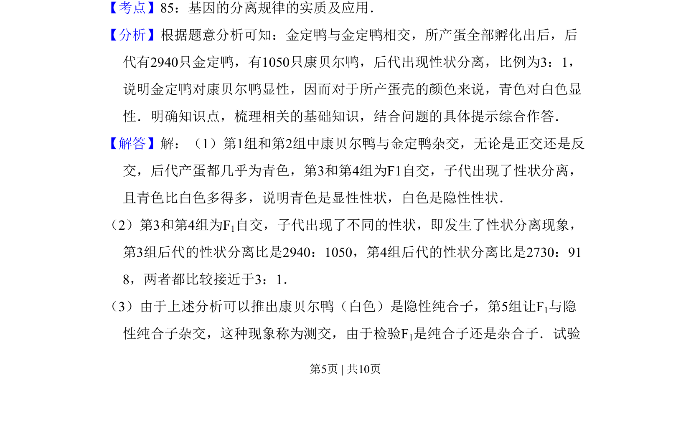
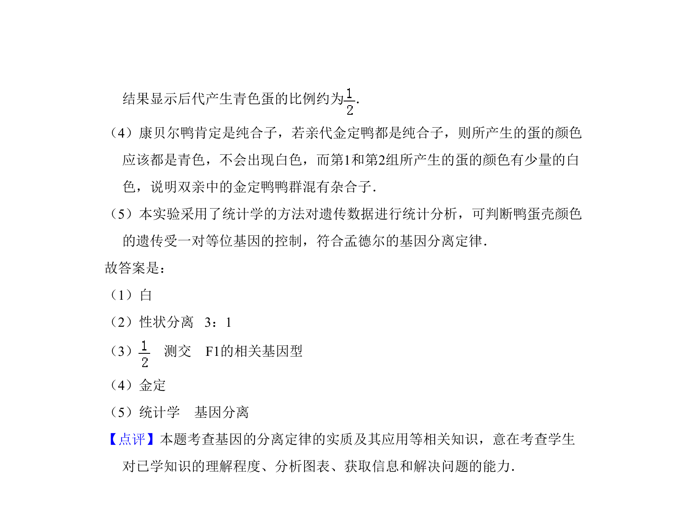

## 题面

## 摘要

研究鸭蛋壳颜色（青色和白色）的遗传规律，通过多组杂交实验分析性状的显隐性和遗传方式。

## 关联考点

- [[266-分离定律|基因的分离定律]]
- [[611-显隐性性状|显隐性性状]]
- [[492-杂交实验|杂交实验]]
- [[517-遗传规律|遗传规律]]

## 答案与解析

> 📄 原 PDF 第 4 页：`素材/真题/北京/2008-2024·（北京）生物高考真题/2009年高考生物试卷（北京）（解析卷）.pdf`

<!-- 题干文本-start -->
## 题干文本
5．（18分）鸭蛋蛋壳的颜色主要有青色和白色两种．金定鸭产青色蛋，康贝尔
鸭产白色蛋．为研究蛋壳颜色的遗传规律，研究者利用这两个鸭群做了五组
实验，结果如表所示：
第1组 第2组 第3组 第4组 第5组杂交组合
康贝尔鸭 金定鸭× 第1组的F1 第2组的 第2组的F1×
<!-- 题干文本-end -->

<!-- 解析文本-start -->
## 解析文本

<!-- 解析文本-end -->
