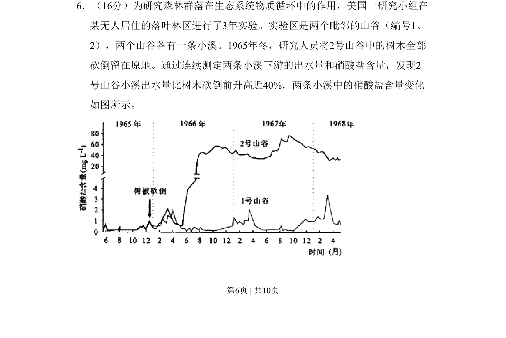
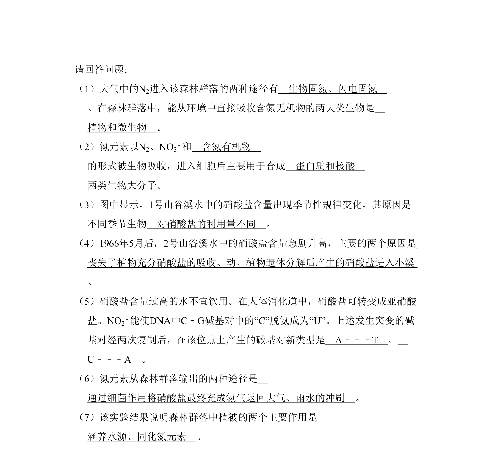
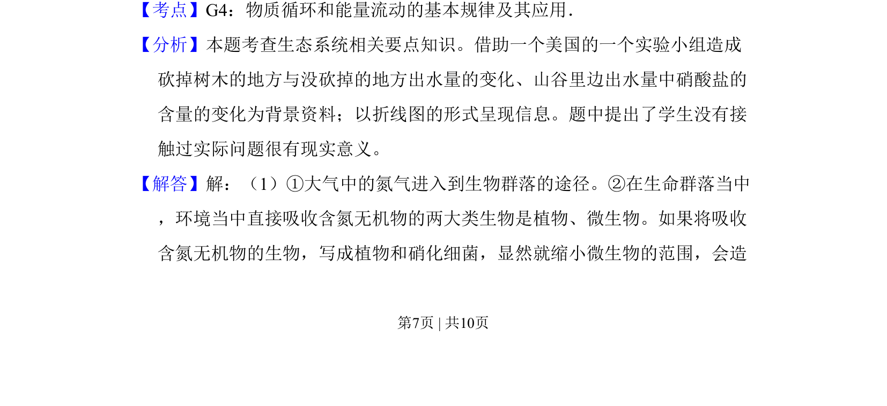
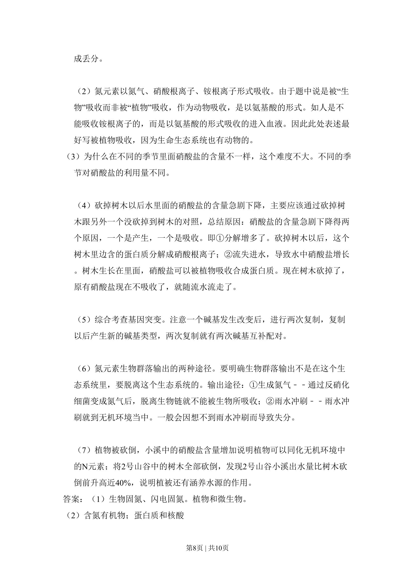
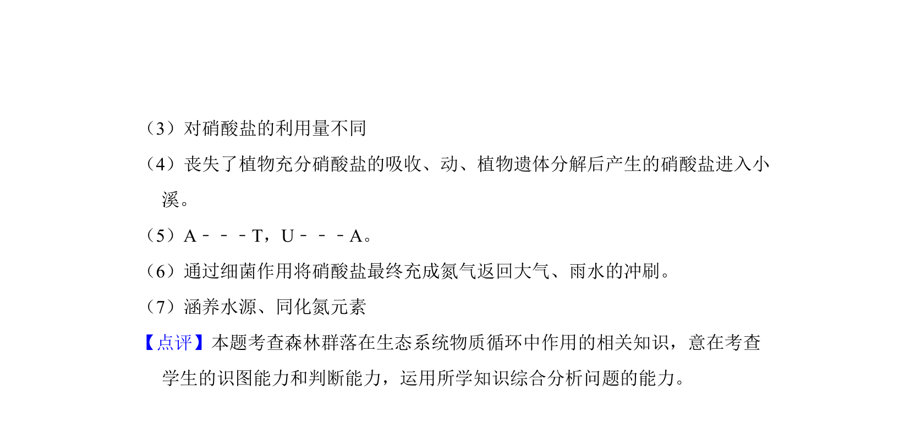

## 题面

## 摘要

该题通过砍伐森林实验分析植被变化对溪流出水量和硝酸盐含量的影响，考查生态系统的物质循环与植被作用。

## 关联考点

- [[854-生态系统的物质循环|生态系统的物质循环]]
- [[水循环]]
- [[植被对水循环的影响]]
- [[干扰对生态系统的影响]]

## 答案与解析

> 📄 原 PDF 第 6 页：`素材/真题/北京/2008-2024·（北京）生物高考真题/2009年高考生物试卷（北京）（解析卷）.pdf`
